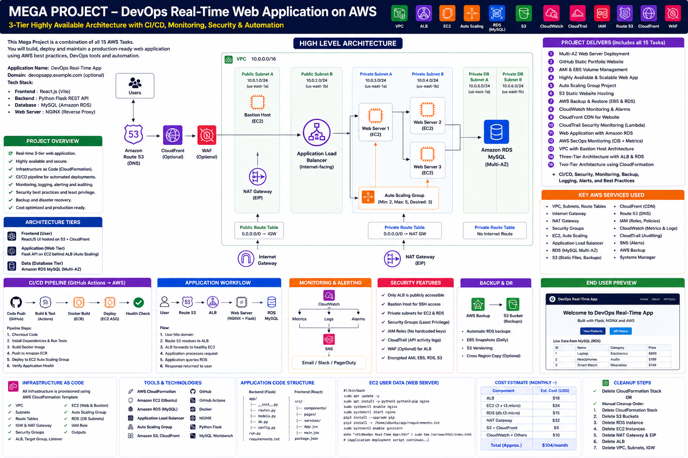

# SecureCloudOps Portal

## Team Implementation and Execution Guide

> This Markdown guide is designed to be placed in the repository root, next to the `Mega_Project_SecureCloudOps_Portal` folder.

---

# 1. Executive Answer: Does Clone and Run Create Everything?

<table>
<colgroup>
<col style="width: 100%" />
</colgroup>
<thead>
<tr class="header">
<th><strong>No — cloning does not create AWS resources 
</strong>git clone only downloads the repository to the local machine. AWS resources are created only after credentials are configured and terraform apply, CloudFormation deployment, or AWS CLI/API commands are intentionally executed.</th>
</tr>
</thead>
<tbody>
</tbody>
</table>

| **Action**                    | **What it does**                                                            | **Creates AWS resources?**                      | **Current status**                   |
|-------------------------------|-----------------------------------------------------------------------------|-------------------------------------------------|--------------------------------------|
| git clone                     | Downloads source code and documentation                                     | No                                              | Ready                                |
| docker compose up --build     | Runs frontend, backend and local MySQL on the student laptop                | No                                              | Ready after .env update              |
| terraform init / plan         | Downloads providers and shows proposed changes                              | No                                              | Ready                                |
| terraform apply               | Creates resources defined in Terraform                                      | Yes                                             | Core infrastructure only             |
| aws cloudformation deploy     | Creates resources defined in the sample CloudFormation template             | Yes                                             | Small supporting example only        |
| Running Lambda Python locally | Executes Python code only if a local event and AWS credentials are supplied | Possibly modifies S3/metrics depending on event | Not recommended as deployment method |

<table>
<colgroup>
<col style="width: 100%" />
</colgroup>
<thead>
<tr class="header">
<th><strong>Current repository limitation 
</strong>The repository contains three Lambda source files, but the Terraform currently does not create Lambda function resources, ZIP packages, S3 event notifications, EventBridge rules, Lambda permissions, SNS subscriptions, or Grafana workspace resources. Those items must be added before “terraform apply” can deploy the full end-to-end platform.</th>
</tr>
</thead>
<tbody>
</tbody>
</table>

# 2. Deployment Readiness Matrix

| **Component**          | **Included in repository** | **Created by current Terraform**                                  | **Action required**                                      |
|------------------------|----------------------------|-------------------------------------------------------------------|----------------------------------------------------------|
| React frontend         | Yes                        | Deployed through EC2 User Data only after GitHub URL is corrected | Update repository URL and test image build               |
| FastAPI backend        | Yes                        | Deployed through EC2 User Data only after GitHub URL is corrected | Configure secrets and database schema                    |
| VPC/Subnets/IGW/NAT    | Yes                        | Yes                                                               | Review cost and CIDRs                                    |
| ALB/Target Group/ASG   | Yes                        | Yes                                                               | Add HTTPS for production                                 |
| RDS MySQL              | Yes                        | Yes                                                               | Create app tables; move password to Secrets Manager      |
| Private S3 bucket      | Yes                        | Yes                                                               | Add event notification                                   |
| File-classifier Lambda | Source only                | No                                                                | Package, create Lambda, grant permission, add S3 trigger |
| Compliance Lambda      | Source only                | No                                                                | Package, create Lambda, add EventBridge schedule         |
| Security Lambda        | Source only                | No                                                                | Package, create Lambda, add EventBridge CloudTrail rules |
| SNS subscription       | Topic only                 | No email subscription                                             | Add confirmed endpoint                                   |
| CloudTrail trail       | Not provisioned            | No                                                                | Create organization/account trail or verify existing     |
| AWS Config             | Not provisioned            | No                                                                | Enable when using compliance checks                      |
| Grafana workspace      | Dashboard JSON only        | No                                                                | Create AMG workspace and data source manually/IaC        |
| GitHub Actions         | Yes                        | No AWS deployment workflow                                        | Add OIDC deployment only after approval                  |

# 3. Team Roles and Responsibilities

| **Role**                   | **Primary work**                                   | **Commands owned**                    | **Evidence to capture**               |
|----------------------------|----------------------------------------------------|---------------------------------------|---------------------------------------|
| Team Lead / Trainer        | Architecture, sequencing, reviews and cost control | terraform plan/apply/destroy approval | Architecture, outputs, final demo     |
| Frontend Engineer          | React UI, login, uploads and API integration       | npm install; npm run build            | UI screenshots and browser tests      |
| Backend Engineer           | FastAPI, RDS schema, auth and S3 APIs              | pytest; uvicorn; database SQL         | Swagger, health and DB evidence       |
| Cloud / Network Engineer   | VPC, ALB, ASG, Bastion, RDS and SGs                | Terraform commands                    | VPC, target health, private IP proof  |
| Security / SecOps Engineer | IAM, CloudTrail, Lambda detections and SNS         | Lambda packaging and event tests      | CloudWatch logs and alert screenshots |
| Observability Engineer     | CloudWatch metrics, alarms and Grafana             | Dashboard import and alert tests      | Dashboard and notification evidence   |
| Release Engineer           | GitHub Actions, versioning and deployment runbook  | git, CI workflow, release tags        | Successful CI run                     |

# 4. Mandatory Prerequisites

## 4.1 Local software

- Git
- VS Code
- Python 3.12+
- Node.js 20+ and npm
- Docker Desktop
- AWS CLI v2
- Terraform 1.6+
- MySQL Workbench
- SSH client
- Postman or curl

git --version  
python --version  
node --version  
npm --version  
docker --version  
aws --version  
terraform version

## 4.2 AWS account and permissions

- Use a sandbox/training AWS account, not production.
- Set an AWS Budget before deployment.
- Use an IAM role or federated login; avoid the root account.
- The deployer needs VPC, EC2, ELBv2, Auto Scaling, RDS, S3, IAM, Lambda, EventBridge, CloudWatch, SNS and CloudTrail permissions.
- Create an EC2 key pair in the target Region.
- Know the administrator public IP in /32 format.

# 5. Recommended Execution Order

| **Phase**                         | **Owner**                  | **Resource impact**                    | **Outcome**                                                           |
|-----------------------------------|----------------------------|----------------------------------------|-----------------------------------------------------------------------|
| Phase 0 – Repository review       | Trainer                    | No resources                           | Read README, replace placeholders, create branches and assign owners. |
| Phase 1 – Local application       | Frontend + Backend         | No AWS resources                       | Run Docker Compose and complete functional testing.                   |
| Phase 2 – Terraform validation    | Cloud engineer             | No AWS resources                       | Run fmt, init, validate and plan.                                     |
| Phase 3 – Core AWS infrastructure | Team lead + Cloud engineer | Creates chargeable AWS resources       | Run terraform apply after review.                                     |
| Phase 4 – Database initialization | Backend engineer           | Writes RDS schema/data                 | Connect privately and create tables.                                  |
| Phase 5 – Application deployment  | Cloud + App engineers      | Starts EC2 containers                  | Correct GitHub URL, secrets and User Data.                            |
| Phase 6 – Lambda automation       | SecOps engineer            | Creates Lambda/EventBridge/S3 triggers | Complete missing IaC and deploy functions.                            |
| Phase 7 – Monitoring              | Observability engineer     | Creates alarms/Grafana                 | Import dashboard and test alerts.                                     |
| Phase 8 – Demo and evidence       | All                        | No new resources expected              | Run tests, capture screenshots and present.                           |
| Phase 9 – Cleanup                 | Team lead                  | Deletes resources                      | Run terraform destroy and verify charges stop.                        |

# 6. Exact Commands: Local First

## 6.1 Clone and prepare

git clone https://github.com/\<ORG_OR_USERNAME\>/\<REPOSITORY\>.git  
cd Mega_Project_SecureCloudOps_Portal  
cp .env.example .env

<table>
<colgroup>
<col style="width: 100%" />
</colgroup>
<thead>
<tr class="header">
<th><strong>Update .env 
</strong>Do not use the sample passwords outside local development. The AWS deployment should retrieve sensitive values from Secrets Manager rather than writing them into files or Terraform state.</th>
</tr>
</thead>
<tbody>
</tbody>
</table>

## 6.2 Run locally

docker compose up --build

Open: Frontend http://localhost:3000 \| API documentation http://localhost:8000/docs \| Health http://localhost:8000/health

## 6.3 Local verification

curl http://localhost:8000/health  
curl http://localhost:8000/api/health/db  
pytest backend/tests  
cd frontend && npm install && npm run build

# 7. Exact Commands: Terraform Core Infrastructure

cd infra/terraform  
cp terraform.tfvars.example terraform.tfvars

Update terraform.tfvars with admin_cidr, key_name, db_password, instance_type and capacity values.

terraform fmt -recursive  
terraform init  
terraform validate  
terraform plan -out=tfplan

<table>
<colgroup>
<col style="width: 100%" />
</colgroup>
<thead>
<tr class="header">
<th><strong>Approval gate 
</strong>The team lead must review the plan. NAT Gateway, ALB, RDS and EC2 are chargeable. Do not run apply until the expected resources and Region are confirmed.</th>
</tr>
</thead>
<tbody>
</tbody>
</table>

terraform apply tfplan  
terraform output

# 8. What Current terraform apply Creates

- VPC, two public subnets, two private application subnets and two private DB subnets
- Internet Gateway, one NAT Gateway, route tables and associations
- ALB, HTTP listener and Target Group
- Launch Template, Auto Scaling Group and CPU target tracking policy
- Private RDS MySQL instance and DB subnet group
- Private encrypted/versioned S3 bucket
- Bastion Host
- EC2 IAM role, SSM policy and S3 application permissions
- SNS topic and Lambda execution IAM role/policy

<table>
<colgroup>
<col style="width: 100%" />
</colgroup>
<thead>
<tr class="header">
<th><strong>It does not yet create 
</strong>Lambda functions, Lambda ZIP archives, S3 notification, EventBridge rules, Lambda invoke permissions, CloudTrail trail, AWS Config recorder, SNS email subscription, Grafana workspace, Grafana data source, CloudWatch alarms, Secrets Manager secrets or Route 53/ACM/WAF.</th>
</tr>
</thead>
<tbody>
</tbody>
</table>

# 9. Lambda Deployment: Required Completion Work

Each function must be packaged, created, granted permissions, and connected to its event source. Simply running the Python file is not the correct production deployment method.

| **Function**       | **Trigger**                     | **Required AWS resources**                                      | **Success proof**                                            |
|--------------------|---------------------------------|-----------------------------------------------------------------|--------------------------------------------------------------|
| file_classifier    | S3 ObjectCreated on uploads/    | Lambda, role, permission, S3 notification, CloudWatch log group | Object moves to classified/finance or classified/non-finance |
| compliance_monitor | EventBridge schedule            | Lambda, role, schedule rule, target permission, SNS             | Custom metrics and compliance notification                   |
| security_monitor   | EventBridge CloudTrail patterns | Lambda, role, event rules, target permissions, SNS/Slack secret | CreateUser/CreateAccessKey/DeleteUser/DeleteBucket alert     |

## 9.1 Packaging example

cd lambdas/file_classifier  
zip -j /tmp/file_classifier.zip lambda_function.py  
aws lambda create-function \\  
--function-name securecloudops-file-classifier \\  
--runtime python3.12 \\  
--handler lambda_function.lambda_handler \\  
--role \<LAMBDA_ROLE_ARN\> \\  
--zip-file fileb:///tmp/file_classifier.zip

<table>
<colgroup>
<col style="width: 100%" />
</colgroup>
<thead>
<tr class="header">
<th><strong>Preferred approach 
</strong>Add aws_lambda_function, archive_file, aws_s3_bucket_notification, aws_lambda_permission, aws_cloudwatch_event_rule and aws_cloudwatch_event_target resources to Terraform so deployment is repeatable. Manual CLI commands are acceptable only for a guided lab.</th>
</tr>
</thead>
<tbody>
</tbody>
</table>

# 10. Database Initialization

Terraform creates the RDS instance and database name, but application tables are created when the backend starts through SQLAlchemy. For controlled deployments, use migrations such as Alembic.

terraform output -raw rds_endpoint  
ssh -i \<key.pem\> -J ubuntu@\<BASTION_PUBLIC_IP\> ubuntu@\<APP_PRIVATE_IP\>  
nc -vz \<RDS_ENDPOINT\> 3306

<table>
<colgroup>
<col style="width: 100%" />
</colgroup>
<thead>
<tr class="header">
<th><strong>Credential warning 
</strong>The sample Terraform accepts db_password as an input, which can appear in Terraform state. Replace this with Secrets Manager or RDS-managed master credentials before production use.</th>
</tr>
</thead>
<tbody>
</tbody>
</table>

# 11. Application Deployment Caveats

- Update infra/terraform/user_data.sh.tftpl with the real GitHub repository URL.
- Ensure the EC2 instances can authenticate to a private repository, or make the training repository public.
- Do not leave JWT_SECRET as replace-from-secrets-manager.
- The frontend NGINX expects a backend service named backend inside Docker Compose.
- The ALB health check calls /health through the frontend container proxy.
- Use immutable images or ECR for reliable production deployments rather than cloning main during boot.

# 12. End-to-End Verification Checklist

☐ ALB DNS returns HTTP 200

☐ All Target Group targets are healthy

☐ EC2 instances have private IPs and no public IPs

☐ RDS is not publicly accessible

☐ S3 Block Public Access is enabled

☐ Register and login work

☐ Finance and non-finance files upload

☐ File classification Lambda moves files

☐ Presigned download URL works

☐ Database metadata is stored

☐ CloudTrail event triggers Security Lambda

☐ Compliance metrics appear in CloudWatch

☐ Grafana panels show current data

☐ SNS/Slack test notification succeeds

☐ Auto Scaling scale-out and scale-in are observed

./scripts/verify-deployment.sh \<ALB_DNS_NAME\>  
aws elbv2 describe-target-health --target-group-arn \<TARGET_GROUP_ARN\>  
aws s3 ls s3://\<BUCKET_NAME\>/ --recursive  
aws logs tail /aws/lambda/\<FUNCTION_NAME\> --follow

# 13. Team Demo Sequence

1\. Explain the architecture from user to ALB, EC2, RDS and S3.

2\. Show that EC2 and RDS are private.

3\. Register a user and log in.

4\. Upload fin_invoice.txt and project_notes.txt.

5\. Show the S3 classification result.

6\. Show the RDS metadata/API response.

7\. Generate a safe CloudTrail test event and show the alert.

8\. Open Grafana and explain compliance/security panels.

9\. Show Terraform state/resources and GitHub Actions validation.

10\. Explain cost, security improvements and cleanup.

# 14. Cost, Safety and Cleanup

<table>
<colgroup>
<col style="width: 100%" />
</colgroup>
<thead>
<tr class="header">
<th><strong>Main cost drivers 
</strong>NAT Gateway, ALB, RDS, EC2 Auto Scaling instances, Amazon Managed Grafana and data transfer. Even idle resources can incur charges.</th>
</tr>
</thead>
<tbody>
</tbody>
</table>

cd infra/terraform  
terraform plan -destroy  
terraform destroy

- Confirm the S3 bucket is empty or force_destroy is understood.
- Confirm RDS final snapshot policy before deletion.
- Verify NAT Gateway and Elastic IP are removed.
- Verify ALB and Target Group are removed.
- Delete manually created Lambda/EventBridge/Grafana resources if they were not added to Terraform.
- Review AWS Cost Explorer and Billing after cleanup.

# 15. Required Improvements Before Giving This as “One-Command Deployment”

1.  Add all Lambda functions and triggers to Terraform.

2.  Add CloudTrail, EventBridge security rules and AWS Config resources.

3.  Create Secrets Manager secrets and remove plaintext DB/JWT secrets from User Data and Terraform variables.

4.  Add SNS email subscription as a parameter or documented manual confirmation step.

5.  Add CloudWatch alarms and Amazon Managed Grafana workspace/data-source permissions.

6.  Replace Git clone in User Data with ECR images or a versioned release artifact.

7.  Add HTTPS using ACM, Route 53 and HTTP-to-HTTPS redirect.

8.  Add WAF for public application protection.

9.  Use Multi-AZ RDS and one NAT Gateway per AZ for production.

10. Use SSM Session Manager instead of Bastion where possible.

11. Add Alembic database migrations.

12. Add a deployment pipeline with GitHub OIDC instead of static AWS keys.

# 16. Final Recommendation to the Trainer

<table>
<colgroup>
<col style="width: 100%" />
</colgroup>
<thead>
<tr class="header">
<th><strong>How to present this project 
</strong>Present it in two stages. Stage 1: local application and core Terraform infrastructure. Stage 2: students complete the missing Lambda/EventBridge/monitoring IaC as team assignments. Do not tell students that cloning and running one command creates the complete system until the missing resources are added and tested.</th>
</tr>
</thead>
<tbody>
</tbody>
</table>

Prepared for team training, hands-on implementation, GitHub portfolio evidence and resume discussion.
