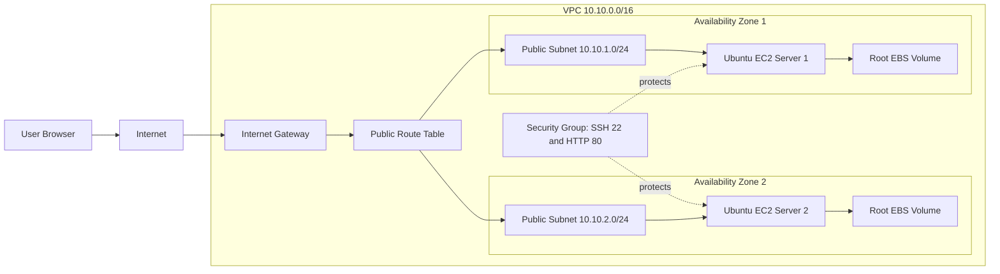

# Project 01 — Multi-AZ Ubuntu Web Server Deployment

## Project Objective

Launch two Ubuntu EC2 instances in different Availability Zones, install NGINX automatically using EC2 User Data, and verify that both web servers are accessible.

This project demonstrates:

- Multi-AZ deployment
- EC2 instance provisioning
- Ubuntu Linux administration
- NGINX installation
- EC2 User Data automation
- Security Group configuration
- Instance Metadata Service v2 usage
- Basic availability testing

> **Important:** Two independently accessible EC2 instances do not provide a single highly available application endpoint. In production, place an Application Load Balancer and Auto Scaling Group in front of the instances.

---

## Architecture Diagram

Add the generated image to this folder using the following name:

```text
images/project-01-multi-az-ubuntu-architecture.png
```

Then display it in GitHub:

```markdown

```

### Logical Architecture



---

## AWS Services Used

| Service | Purpose |
|---|---|
| Amazon VPC | Provides the isolated network |
| Public Subnets | Host EC2 instances with internet access |
| Internet Gateway | Enables internet connectivity |
| Route Table | Routes public traffic to the Internet Gateway |
| Amazon EC2 | Runs Ubuntu web servers |
| Amazon EBS | Provides root storage |
| Security Groups | Controls inbound and outbound traffic |
| EC2 User Data | Automates NGINX installation and page creation |

---

## Prerequisites

Before starting, ensure you have:

- An AWS account
- Permission to create VPC and EC2 resources
- An EC2 key pair
- Your current public IP address
- AWS CLI installed, optional
- A GitHub repository for documentation

Recommended lab settings:

| Item | Example |
|---|---|
| AWS Region | `ap-south-1` |
| Ubuntu Version | Ubuntu Server 24.04 LTS |
| Instance Type | `t3.micro` |
| VPC CIDR | `10.10.0.0/16` |
| Public Subnet 1 | `10.10.1.0/24` |
| Public Subnet 2 | `10.10.2.0/24` |
| Web Port | `80` |
| SSH Port | `22` |

---

# Step-by-Step Execution

## Step 1 — Create a Key Pair

1. Sign in to the AWS Management Console.
2. Open **EC2**.
3. Go to **Network & Security → Key Pairs**.
4. Select **Create key pair**.
5. Enter:

```text
Name: ubuntu-multi-az-key
Key pair type: RSA
Private key format: .pem
```

6. Select **Create key pair**.
7. Save the downloaded `.pem` file securely.

For Linux, macOS, or Git Bash:

```bash
chmod 400 ubuntu-multi-az-key.pem
```

Never upload the private key to GitHub.

---

## Step 2 — Create the VPC

1. Open **VPC**.
2. Select **Create VPC**.
3. Choose **VPC only**.
4. Enter:

```text
Name: multi-az-ubuntu-vpc
IPv4 CIDR: 10.10.0.0/16
IPv6 CIDR: None
Tenancy: Default
```

5. Select **Create VPC**.
6. Enable DNS hostnames:

```text
VPC → Your VPCs → Select VPC
Actions → Edit VPC settings
Enable DNS resolution
Enable DNS hostnames
```

---

## Step 3 — Create Two Public Subnets

### Public Subnet 1

1. Open **VPC → Subnets**.
2. Select **Create subnet**.
3. Choose `multi-az-ubuntu-vpc`.
4. Enter:

```text
Subnet name: public-subnet-az1
Availability Zone: Select the first AZ
IPv4 subnet CIDR: 10.10.1.0/24
```

### Public Subnet 2

Create another subnet:

```text
Subnet name: public-subnet-az2
Availability Zone: Select a different AZ
IPv4 subnet CIDR: 10.10.2.0/24
```

### Enable Public IPv4 Assignment

For both subnets:

1. Select the subnet.
2. Choose **Actions → Edit subnet settings**.
3. Enable:

```text
Auto-assign public IPv4 address
```

---

## Step 4 — Create and Attach an Internet Gateway

1. Open **VPC → Internet Gateways**.
2. Select **Create internet gateway**.
3. Enter:

```text
Name: multi-az-ubuntu-igw
```

4. Create the Internet Gateway.
5. Select it.
6. Choose **Actions → Attach to a VPC**.
7. Select `multi-az-ubuntu-vpc`.
8. Choose **Attach Internet Gateway**.

---

## Step 5 — Create a Public Route Table

1. Open **VPC → Route Tables**.
2. Select **Create route table**.
3. Enter:

```text
Name: multi-az-public-rt
VPC: multi-az-ubuntu-vpc
```

4. Create the route table.
5. Open the **Routes** tab.
6. Select **Edit routes**.
7. Add:

```text
Destination: 0.0.0.0/0
Target: multi-az-ubuntu-igw
```

8. Save the route.
9. Open **Subnet associations**.
10. Select **Edit subnet associations**.
11. Select:

```text
public-subnet-az1
public-subnet-az2
```

12. Save associations.

---

## Step 6 — Create a Security Group

1. Open **EC2 → Security Groups**.
2. Select **Create security group**.
3. Enter:

```text
Security group name: ubuntu-web-sg
Description: Allow HTTP and restricted SSH
VPC: multi-az-ubuntu-vpc
```

### Inbound Rules

| Type | Protocol | Port | Source |
|---|---|---:|---|
| SSH | TCP | 22 | Your public IP `/32` |
| HTTP | TCP | 80 | `0.0.0.0/0` |

For IPv6 environments, add HTTP from `::/0` only when needed.

### Outbound Rules

Keep the default outbound rule for the lab:

```text
All traffic → 0.0.0.0/0
```

---

## Step 7 — Prepare the Ubuntu User Data Script

Create `scripts/user-data.sh` with the following content:

```bash
#!/bin/bash
set -euxo pipefail

export DEBIAN_FRONTEND=noninteractive

apt-get update -y
apt-get install -y nginx curl

systemctl enable nginx
systemctl start nginx

TOKEN=$(curl -sS -X PUT \
  -H "X-aws-ec2-metadata-token-ttl-seconds: 21600" \
  http://169.254.169.254/latest/api/token)

INSTANCE_ID=$(curl -sS \
  -H "X-aws-ec2-metadata-token: ${TOKEN}" \
  http://169.254.169.254/latest/meta-data/instance-id)

AZ=$(curl -sS \
  -H "X-aws-ec2-metadata-token: ${TOKEN}" \
  http://169.254.169.254/latest/meta-data/placement/availability-zone)

LOCAL_IPV4=$(curl -sS \
  -H "X-aws-ec2-metadata-token: ${TOKEN}" \
  http://169.254.169.254/latest/meta-data/local-ipv4)

HOST_NAME=$(hostname)

cat > /var/www/html/index.html <<EOF
<!DOCTYPE html>
<html lang="en">
<head>
    <meta charset="UTF-8">
    <meta name="viewport" content="width=device-width, initial-scale=1.0">
    <title>Multi-AZ Ubuntu Web Server</title>
    <style>
        body {
            font-family: Arial, sans-serif;
            background: #f4f6f8;
            margin: 0;
            padding: 40px;
            text-align: center;
        }

        .container {
            max-width: 760px;
            margin: auto;
            background: white;
            padding: 35px;
            border-radius: 12px;
            box-shadow: 0 4px 18px rgba(0,0,0,0.12);
        }

        h1 {
            color: #e95420;
        }

        table {
            margin: 25px auto;
            border-collapse: collapse;
            width: 90%;
        }

        th, td {
            border: 1px solid #dddddd;
            padding: 12px;
        }

        th {
            background: #e95420;
            color: white;
        }

        .status {
            color: green;
            font-weight: bold;
        }
    </style>
</head>
<body>
    <div class="container">
        <h1>Ubuntu Multi-AZ Web Server</h1>
        <p class="status">NGINX is running successfully</p>

        <table>
            <tr>
                <th>Property</th>
                <th>Value</th>
            </tr>
            <tr>
                <td>Hostname</td>
                <td>${HOST_NAME}</td>
            </tr>
            <tr>
                <td>Instance ID</td>
                <td>${INSTANCE_ID}</td>
            </tr>
            <tr>
                <td>Availability Zone</td>
                <td>${AZ}</td>
            </tr>
            <tr>
                <td>Private IP</td>
                <td>${LOCAL_IPV4}</td>
            </tr>
            <tr>
                <td>Operating System</td>
                <td>Ubuntu Server</td>
            </tr>
        </table>
    </div>
</body>
</html>
EOF

nginx -t
systemctl restart nginx
```

---

## Step 8 — Launch Ubuntu EC2 Instance in Availability Zone 1

1. Open **EC2 → Instances**.
2. Select **Launch instances**.
3. Configure:

```text
Name: ubuntu-web-server-az1
AMI: Ubuntu Server 24.04 LTS
Architecture: 64-bit x86
Instance type: t3.micro
Key pair: ubuntu-multi-az-key
VPC: multi-az-ubuntu-vpc
Subnet: public-subnet-az1
Auto-assign public IP: Enable
Security group: ubuntu-web-sg
Storage: 8 GiB gp3
```

4. Expand **Advanced details**.
5. Set **Metadata version** to require IMDSv2 when available.
6. Paste the User Data script.
7. Select **Launch instance**.

---

## Step 9 — Launch Ubuntu EC2 Instance in Availability Zone 2

Repeat the previous step with these changes:

```text
Name: ubuntu-web-server-az2
Subnet: public-subnet-az2
```

Use the same:

- Ubuntu AMI
- Instance type
- Key pair
- Security group
- User Data script

---

## Step 10 — Verify Both Instances

Wait until both instances show:

```text
Instance state: Running
Status checks: 2/2 checks passed
```

Use AWS CLI:

```bash
aws ec2 describe-instances \
  --filters "Name=tag:Name,Values=ubuntu-web-server-*" \
  --query "Reservations[].Instances[].{
    Name:Tags[?Key=='Name']|[0].Value,
    InstanceId:InstanceId,
    State:State.Name,
    AZ:Placement.AvailabilityZone,
    PublicIP:PublicIpAddress,
    PrivateIP:PrivateIpAddress
  }" \
  --output table
```

---

## Step 11 — Test from the Browser

Copy the public IPv4 address of Server 1:

```text
http://SERVER-1-PUBLIC-IP
```

Copy the public IPv4 address of Server 2:

```text
http://SERVER-2-PUBLIC-IP
```

You should see:

- NGINX success status
- Different EC2 instance IDs
- Different Availability Zones
- Different hostnames
- Different private IP addresses

---

## Step 12 — Test Using `curl`

```bash
curl http://SERVER-1-PUBLIC-IP
curl http://SERVER-2-PUBLIC-IP
```

Check only the instance details:

```bash
curl -s http://SERVER-1-PUBLIC-IP | grep -E "Instance ID|Availability Zone"
curl -s http://SERVER-2-PUBLIC-IP | grep -E "Instance ID|Availability Zone"
```

---

## Step 13 — Connect to Ubuntu Through SSH

```bash
ssh -i ubuntu-multi-az-key.pem ubuntu@SERVER-PUBLIC-IP
```

The default Ubuntu username is:

```text
ubuntu
```

Check the operating system:

```bash
cat /etc/os-release
```

Check NGINX:

```bash
sudo systemctl status nginx
```

Check listening ports:

```bash
sudo ss -lntp
```

Test locally:

```bash
curl http://localhost
```

View logs:

```bash
sudo tail -f /var/log/nginx/access.log
sudo tail -f /var/log/nginx/error.log
```

View User Data execution logs:

```bash
sudo cat /var/log/cloud-init-output.log
sudo cloud-init status --long
```

---

# Availability Test

## What This Test Proves

The instances are deployed independently across two Availability Zones.

### Test Procedure

1. Confirm both servers are accessible.
2. Stop `ubuntu-web-server-az1`.
3. Wait until it is stopped.
4. Confirm `ubuntu-web-server-az2` remains accessible.
5. Start Server 1 again.

This proves that a failure in one server or AZ does not directly stop the server in the other AZ.

## What This Test Does Not Prove

Users are not automatically redirected to the healthy server because this architecture does not contain:

- Application Load Balancer
- Auto Scaling Group
- Route 53 failover routing
- A single application endpoint

For real high availability, use:

```text
Users
  ↓
Application Load Balancer
  ↓
Target Group
  ↓
EC2 instances in multiple Availability Zones
  ↓
Auto Scaling Group
```

---

# Validation Checklist

- [ ] VPC created
- [ ] Two public subnets created in different AZs
- [ ] Internet Gateway attached
- [ ] Public route configured
- [ ] Both subnets associated with the public route table
- [ ] Security Group created
- [ ] SSH restricted to personal IP
- [ ] HTTP port 80 open
- [ ] Two Ubuntu EC2 instances running
- [ ] Instances deployed in different AZs
- [ ] NGINX active on both servers
- [ ] Web pages accessible
- [ ] Different instance IDs displayed
- [ ] Different Availability Zones displayed
- [ ] One-server stop test completed
- [ ] Cleanup completed after practice

---

# Troubleshooting

## Website Does Not Open

Check the Security Group:

```text
HTTP TCP 80 Source 0.0.0.0/0
```

Check the route:

```text
0.0.0.0/0 → Internet Gateway
```

Check whether the instance has a public IPv4 address.

Check NGINX:

```bash
sudo systemctl status nginx
sudo nginx -t
sudo systemctl restart nginx
```

Check locally:

```bash
curl http://localhost
```

---

## SSH Connection Times Out

Check:

- SSH port 22 is allowed from your current IP
- The `.pem` key is correct
- The username is `ubuntu`
- The instance has a public IP
- The subnet route points to the Internet Gateway
- Network ACLs allow SSH and return traffic

Example:

```bash
ssh -vvv -i ubuntu-multi-az-key.pem ubuntu@SERVER-PUBLIC-IP
```

---

## User Data Did Not Install NGINX

Check:

```bash
sudo cloud-init status --long
sudo less /var/log/cloud-init-output.log
sudo journalctl -u cloud-final
```

Retry manually:

```bash
sudo apt-get update -y
sudo apt-get install -y nginx
sudo systemctl enable --now nginx
```

---

## NGINX Returns the Default Ubuntu Page

The custom file may not have been created correctly.

Check:

```bash
sudo cat /var/www/html/index.html
```

Replace the file and restart NGINX:

```bash
sudo nginx -t
sudo systemctl restart nginx
```

---

## IMDS Metadata Commands Fail

The instance may require IMDSv2. Use the token-based commands provided in the User Data script instead of an unauthenticated metadata request.

---

# Useful AWS CLI Commands

List the two project instances:

```bash
aws ec2 describe-instances \
  --filters "Name=tag:Name,Values=ubuntu-web-server-*" \
  --query "Reservations[].Instances[].[
    InstanceId,
    Placement.AvailabilityZone,
    State.Name,
    PublicIpAddress
  ]" \
  --output table
```

List project Security Groups:

```bash
aws ec2 describe-security-groups \
  --filters "Name=group-name,Values=ubuntu-web-sg" \
  --output table
```

Check instance status:

```bash
aws ec2 describe-instance-status \
  --include-all-instances \
  --output table
```

Stop one test instance:

```bash
aws ec2 stop-instances \
  --instance-ids i-REPLACE_WITH_INSTANCE_ID
```

Start it again:

```bash
aws ec2 start-instances \
  --instance-ids i-REPLACE_WITH_INSTANCE_ID
```

---

# Repository Structure

```text
project-01-multi-az-ubuntu-web-server/
├── README.md
├── images/
│   └── project-01-multi-az-ubuntu-architecture.png
├── scripts/
│   └── user-data.sh
└── .gitignore
```

Suggested `.gitignore`:

```gitignore
*.pem
*.key
.env
.DS_Store
```

---

# Cleanup

To prevent unnecessary charges:

1. Terminate both EC2 instances.
2. Wait until they are terminated.
3. Delete unused EBS volumes if any remain.
4. Delete the Security Group.
5. Delete the custom Route Table.
6. Detach and delete the Internet Gateway.
7. Delete both subnets.
8. Delete the VPC.
9. Delete the key pair from AWS if it is no longer required.
10. Delete the local `.pem` file only when you are certain it is no longer needed.

---

# Interview Questions

1. Why should EC2 instances be distributed across Availability Zones?
2. What is the difference between an Availability Zone and a Region?
3. Why does a public subnet need a route to an Internet Gateway?
4. What makes a subnet public?
5. What is the difference between a Security Group and a Network ACL?
6. Why should SSH be restricted to a `/32` source?
7. What is EC2 User Data?
8. When does User Data run?
9. How do you troubleshoot failed User Data?
10. Why did we use IMDSv2?
11. What is the default SSH username for an Ubuntu EC2 instance?
12. What is the purpose of the root EBS volume?
13. Does deploying two EC2 instances automatically provide failover?
14. Why is an Application Load Balancer required?
15. How would an Auto Scaling Group improve this design?
16. How would you deploy these EC2 instances in private subnets?
17. How would administrators access private EC2 instances securely?
18. How would you enable HTTPS?
19. How would you avoid managing SSH keys?
20. How would you monitor NGINX and EC2 health?

---

# Production Improvements

For a production-ready architecture, add:

- Application Load Balancer
- Auto Scaling Group
- Private EC2 subnets
- NAT Gateway or VPC endpoints where required
- AWS Systems Manager Session Manager
- HTTPS using AWS Certificate Manager
- Route 53 DNS
- CloudWatch metrics, logs, and alarms
- AWS WAF
- IAM instance role
- Golden AMI or configuration management
- Infrastructure as Code using Terraform or CloudFormation
- Automated deployment pipeline
- Centralized log storage
- Backup and disaster-recovery strategy

---

## Final Result

After completing this project, you will have:

- Two Ubuntu EC2 instances
- NGINX installed automatically
- Instances running in different Availability Zones
- Individual web pages showing instance information
- A documented Multi-AZ deployment
- A complete GitHub-ready project
