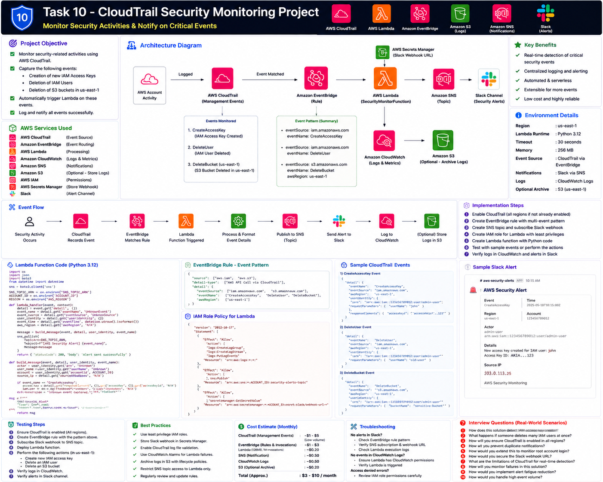

# Part 1 — Introduction, Architecture and Prerequisites

[← Main README](../README.md) | [Next: Part 2 →](README_PART2.md)

## Objective

Build an event-driven monitoring solution for:

| Event | Service | Risk |
|---|---|---|
| `CreateAccessKey` | IAM | New long-term credential |
| `DeleteUser` | IAM | Identity removal or evidence destruction |
| `DeleteBucket` | S3 | Data-loss risk |

The S3 bucket deletion event must be monitored only when:

```text
Region: us-east-1
```

## AWS Services Used

| Service | Purpose |
|---|---|
| AWS CloudTrail | Captures management API activity |
| Amazon EventBridge | Routes matching events |
| AWS Lambda | Parses, classifies and logs events |
| Amazon CloudWatch Logs | Stores structured security records |
| Amazon SNS | Sends notifications |
| AWS Secrets Manager | Optional Slack webhook storage |
| Amazon S3 | Optional long-term archive |

## Architecture



## Detection Rules

### IAM Access Key Creation

```text
eventSource = iam.amazonaws.com
eventName   = CreateAccessKey
```

### IAM User Deletion

```text
eventSource = iam.amazonaws.com
eventName   = DeleteUser
```

### S3 Bucket Deletion

```text
eventSource = s3.amazonaws.com
eventName   = DeleteBucket
awsRegion   = us-east-1
```

## Prerequisites

- AWS account
- Permissions for CloudTrail, EventBridge, Lambda, SNS, IAM and CloudWatch
- Test environment
- Optional Slack Incoming Webhook
- AWS CLI
- Approved temporary IAM user and S3 bucket for testing

## Naming Convention

| Resource | Name |
|---|---|
| Lambda | `task10-cloudtrail-security-monitor` |
| IAM role | `task10-security-monitor-role` |
| SNS topic | `task10-security-alerts` |
| IAM rule | `task10-iam-security-events` |
| S3 rule | `task10-s3-deletebucket-us-east-1` |
| Log group | `/aws/lambda/task10-cloudtrail-security-monitor` |

## Checklist

- [ ] Test account selected
- [ ] SNS email available
- [ ] us-east-1 S3 test understood
- [ ] Cleanup plan prepared
- [ ] CloudTrail event flow understood
