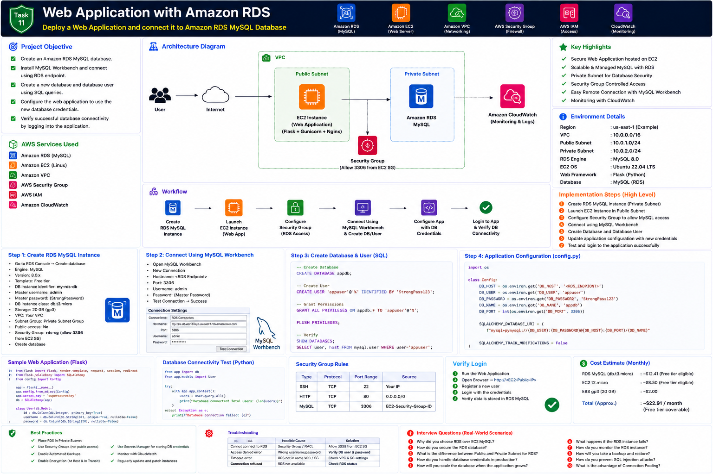

# Part 1 — Introduction, Architecture and Prerequisites

[← Main README](../README.md) | [Next: Part 2 →](README_PART2.md)

## Objective

Deploy a three-layer training architecture:

```text
User Browser
    ↓
NGINX on Ubuntu EC2
    ↓
Gunicorn + Flask Application
    ↓
Amazon RDS MySQL
```

## AWS Services Used

| Service | Purpose |
|---|---|
| Amazon EC2 | Hosts the application |
| Amazon RDS for MySQL | Managed relational database |
| Amazon VPC | Network boundary |
| Public subnet | Hosts EC2 for the training setup |
| Private DB subnets | Host RDS |
| Security Groups | Control HTTP, SSH and MySQL traffic |
| AWS Secrets Manager | Recommended credential storage |
| Amazon CloudWatch | Logs and monitoring |
| AWS IAM | Controls AWS permissions |

## Architecture



## Recommended Production Design

- RDS should not be publicly accessible.
- RDS should use private subnets in at least two Availability Zones.
- Port `3306` should be allowed only from the EC2 application Security Group.
- Database credentials should not be committed to GitHub.
- Encryption at rest and TLS in transit should be enabled.
- Multi-AZ is recommended for production workloads.
- RDS Proxy can improve connection scalability and resilience.

## Prerequisites

- AWS account
- Ubuntu EC2 key pair
- MySQL Workbench installed locally
- Python 3 and Git
- Basic SQL knowledge
- Unique RDS DB identifier
- Secure password manager

## Naming Convention

| Resource | Name |
|---|---|
| RDS instance | `task11-mysql-db` |
| Database | `appdb` |
| Application DB user | `appuser` |
| EC2 instance | `task11-flask-web` |
| EC2 Security Group | `task11-web-sg` |
| RDS Security Group | `task11-rds-sg` |
| DB subnet group | `task11-db-subnet-group` |

## Important Security Note

For the local MySQL Workbench exercise, temporary direct access can be allowed only from your public IP.

After SQL setup, remove the local IP rule and keep only:

```text
MySQL/Aurora | TCP | 3306 | Source: task11-web-sg
```

## Checklist

- [ ] VPC selected
- [ ] Two private DB subnets available
- [ ] EC2 key pair available
- [ ] MySQL Workbench installed
- [ ] Secure passwords prepared
- [ ] Private RDS design understood
