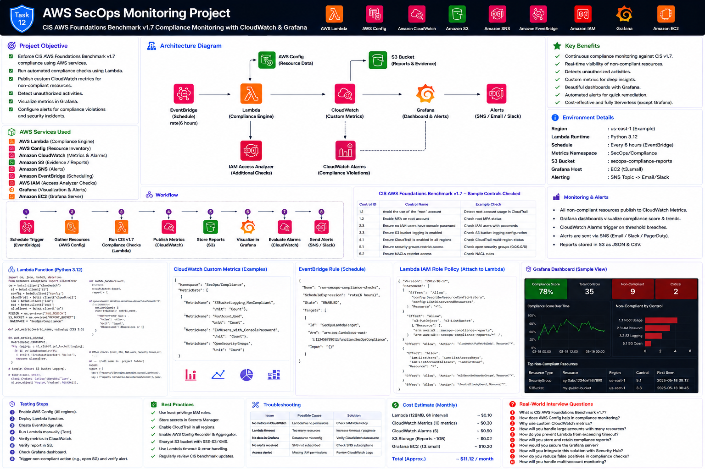

# Project 12 — AWS SecOps Monitoring

This project creates a serverless SecOps monitoring solution using AWS Lambda, CloudWatch custom metrics, EventBridge, Amazon Managed Grafana, SNS and supporting AWS security services.

## Core Capabilities

- Runs scheduled CIS-aligned AWS Foundations checks
- Publishes custom CloudWatch metrics for compliance failures
- Processes selected unauthorized or high-risk CloudTrail activities
- Visualizes metrics in Grafana
- Configures Grafana and CloudWatch alerts
- Stores structured reports for evidence and troubleshooting

> **Important:** This repository implements a practical training subset mapped to common CIS AWS Foundations control families. It is not a substitute for the licensed CIS Benchmark document, an official CIS certification, AWS Security Hub CSPM, or a complete audit.

## Documentation

1. [Part 1 — Introduction, Architecture and Scope](documentation/README_PART1.md)
2. [Part 2 — IAM, SNS, S3 and Lambda Setup](documentation/README_PART2.md)
3. [Part 3 — Compliance Checks and Custom Metrics](documentation/README_PART3.md)
4. [Part 4 — Grafana Dashboard and Alerting](documentation/README_PART4.md)
5. [Part 5 — Testing, Troubleshooting, Cleanup and Production Recommendations](documentation/README_PART5.md)

## Interview Preparation

- [Interview Guide](interview/Interview_Guide.md)
- [Production Scenarios](interview/Production_Scenarios.md)
- [AWS CLI Cheat Sheet](interview/AWS_CLI_CheatSheet.md)
- [Troubleshooting Guide](interview/Troubleshooting_Guide.md)
