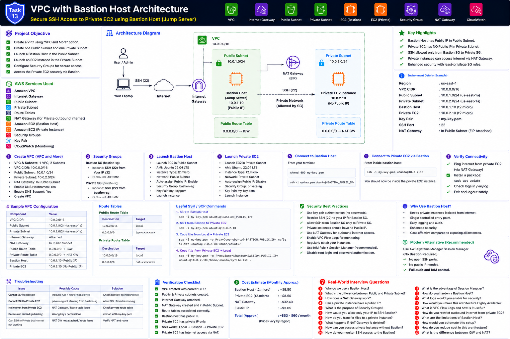

# Project 13 — VPC with Bastion Host Architecture



This project creates a custom VPC with one public subnet, one private subnet, a Bastion Host in the public subnet, and a private EC2 instance accessible only through the Bastion Host.

## Project Requirements

- Create a VPC using the **VPC and More** option
- Create one Public Subnet
- Create one Private Subnet
- Launch a Bastion Host in the Public Subnet
- Launch a Private EC2 instance in the Private Subnet
- Configure secure SSH access through the Bastion Host
- Verify connectivity from Bastion to the Private EC2 instance

## Documentation

1. [Part 1 — Introduction, Architecture and Prerequisites](documentation/README_PART1.md)
2. [Part 2 — VPC, Subnets, Gateways and Route Tables](documentation/README_PART2.md)
3. [Part 3 — Security Groups and EC2 Deployment](documentation/README_PART3.md)
4. [Part 4 — Bastion SSH Access and Verification](documentation/README_PART4.md)
5. [Part 5 — Troubleshooting, Cleanup and Production Recommendations](documentation/README_PART5.md)

## Interview Preparation

- [Interview Guide](interview/Interview_Guide.md)
- [Production Scenarios](interview/Production_Scenarios.md)
- [AWS CLI Cheat Sheet](interview/AWS_CLI_CheatSheet.md)
- [Troubleshooting Guide](interview/Troubleshooting_Guide.md)

## Architecture Flow

```text
Administrator Laptop
        ↓ SSH 22
Internet
        ↓
Internet Gateway
        ↓
Public Subnet
        ↓
Bastion Host
        ↓ SSH 22
Private Subnet
        ↓
Private EC2 Instance
```
