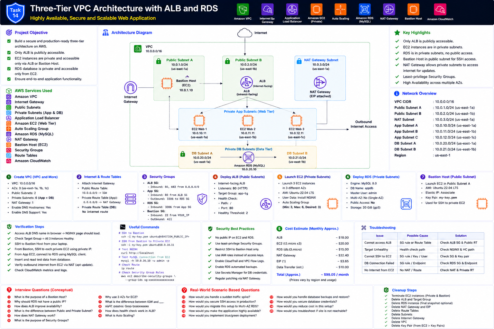

# Project 14 — Three-Tier VPC Architecture with ALB and RDS

This project deploys a production-style three-tier AWS architecture using an internet-facing Application Load Balancer, three private EC2 application servers, a private Amazon RDS MySQL database, and a Bastion Host for controlled administration.

## Main Requirements

- Create a VPC using **VPC and More**
- Configure public and private subnets
- Deploy an internet-facing ALB in public subnets
- Launch three EC2 instances in private subnets
- Configure NGINX and a sample Flask application
- Register all private EC2 instances in an ALB Target Group
- Deploy private Amazon RDS MySQL
- Allow EC2-to-RDS communication
- Deploy a Bastion Host in a public subnet
- Configure IGW, NAT Gateway, route tables and Security Groups
- Ensure only the ALB is publicly accessible
- Verify end-to-end application functionality

## Documentation

1. [Part 1 — Introduction, Architecture and Prerequisites](documentation/README_PART1.md)
2. [Part 2 — VPC, Subnets, Gateways and Route Tables](documentation/README_PART2.md)
3. [Part 3 — Security Groups, Bastion, ALB and EC2](documentation/README_PART3.md)
4. [Part 4 — RDS, Application Deployment and Connectivity](documentation/README_PART4.md)
5. [Part 5 — Verification, Troubleshooting, Cleanup and Production Recommendations](documentation/README_PART5.md)

## Interview Preparation

- [Interview Guide](interview/Interview_Guide.md)
- [Production Scenarios](interview/Production_Scenarios.md)
- [AWS CLI Cheat Sheet](interview/AWS_CLI_CheatSheet.md)
- [Troubleshooting Guide](interview/Troubleshooting_Guide.md)
