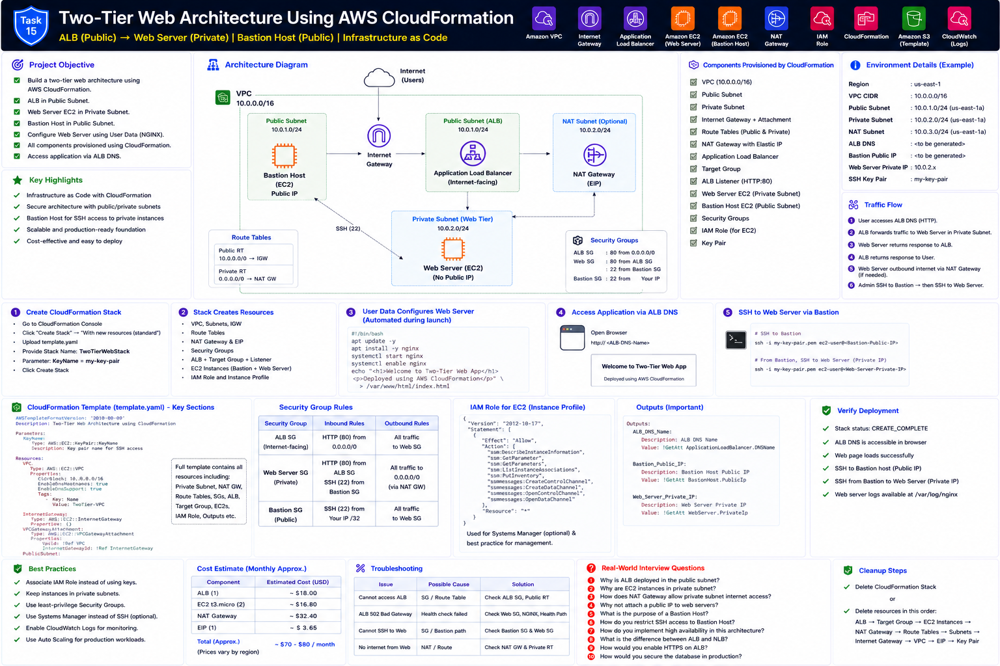

# Part 1 — Architecture, Requirements and Prerequisites

[← Main README](../README.md) | [Next: Part 2 →](README_PART2.md)

## Objective

Provision a two-tier architecture entirely through CloudFormation:

```text
Internet Users
      ↓
Application Load Balancer
      ↓
Private EC2 Web Server
```

Administration:

```text
Administrator
      ↓ SSH
Public Bastion Host
      ↓ SSH
Private Web Server
```

## Architecture



## AWS Services Used

| Service | Purpose |
|---|---|
| AWS CloudFormation | Infrastructure as Code and stack lifecycle |
| Amazon VPC | Isolated network |
| Public Subnets | ALB, Bastion and NAT Gateway |
| Private Subnet | Web Server |
| Internet Gateway | Public routing |
| NAT Gateway | Private EC2 outbound internet |
| Application Load Balancer | Public HTTP endpoint |
| Target Group | Registers and health-checks Web Server |
| Amazon EC2 | Bastion and Web Server |
| AWS IAM | EC2 instance role |
| Systems Manager | Recommended alternative administration path |
| CloudWatch | Native EC2 and ALB monitoring |

## Corrected Subnet Requirement

An internet-facing Application Load Balancer must span at least two Availability Zones. The corrected design therefore uses two public subnets:

```text
Public Subnet A: 10.0.1.0/24 in Availability Zone A
Public Subnet B: 10.0.2.0/24 in Availability Zone B
Private Subnet A: 10.0.11.0/24 for the Web Server
```

Resource placement:

```text
ALB → Public Subnet A and Public Subnet B
Bastion Host → Public Subnet A
NAT Gateway → Public Subnet A
Web Server → Private Subnet A
```

## Traffic Rules

```text
Internet → ALB SG :80
ALB SG → Web SG :80
Administrator CIDR → Bastion SG :22
Bastion SG → Web SG :22
```

## Route Design

### Public Route Table

```text
10.0.0.0/16 → local
0.0.0.0/0   → Internet Gateway
```

### Private Route Table

```text
10.0.0.0/16 → local
0.0.0.0/0   → NAT Gateway
```

## Prerequisites

- AWS account
- AWS CLI configured
- Existing EC2 key pair
- Your current public IP in `/32` format
- CloudFormation permissions
- Permission to create named IAM roles
- Region with at least two Availability Zones

## Parameters

| Parameter | Default |
|---|---|
| `VpcCidr` | `10.0.0.0/16` |
| `PublicSubnetACidr` | `10.0.1.0/24` |
| `PublicSubnetBCidr` | `10.0.2.0/24` |
| `PrivateSubnetCidr` | `10.0.11.0/24` |
| `BastionInstanceType` | `t3.micro` |
| `WebInstanceType` | `t3.micro` |
| `UbuntuAmiId` | Latest Ubuntu Server 24.04 LTS through SSM |
| `AdminCidr` | Required |
| `KeyName` | Required |

## Cost Warning

The NAT Gateway and ALB are chargeable even with very little traffic.

Delete the stack after completing the lab.

## Checklist

- [ ] AWS CLI authenticated
- [ ] Key pair exists in deployment Region
- [ ] Public IP identified
- [ ] Named-IAM capability understood
- [ ] ALB two-subnet requirement understood
- [ ] NAT Gateway cost understood
