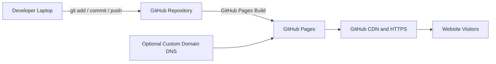

# Project 02 — GitHub Static Portfolio Website

## Project Objective

Create a personal portfolio website using HTML, CSS, and JavaScript, store the source code in GitHub, and publish the website using GitHub Pages.

This project demonstrates:

- Git and GitHub repository management
- Static website development
- GitHub Pages deployment
- HTML, CSS, and JavaScript fundamentals
- Version control and deployment workflow
- Optional custom domain and HTTPS configuration

---

## Architecture Diagram

Save the generated architecture image with this name:

```text
images/project-02-github-pages-architecture.png
```

Add it to this README using:

```markdown

```

### Logical Architecture



---

## Project Flow

```text
Developer creates website files
        ↓
Git repository initialized
        ↓
Code pushed to GitHub
        ↓
GitHub Pages enabled
        ↓
Website published over HTTPS
        ↓
Visitors access the portfolio URL
```

---

## Prerequisites

Before starting, install or prepare:

- Git
- GitHub account
- Visual Studio Code or another editor
- Web browser
- Basic HTML, CSS, and JavaScript knowledge
- Optional custom domain

Check Git:

```bash
git --version
```

Configure Git identity:

```bash
git config --global user.name "Your Name"
git config --global user.email "your-email@example.com"
```

Check configuration:

```bash
git config --global --list
```

---

## Recommended Repository Structure

```text
project-02-github-static-portfolio/
├── README.md
├── images/
│   └── project-02-github-pages-architecture.png
├── site/
│   ├── index.html
│   ├── style.css
│   ├── script.js
│   └── assets/
│       ├── profile.jpg
│       ├── project-1.png
│       └── resume.pdf
└── .gitignore
```

GitHub Pages can publish files from:

- Repository root
- `/docs` folder
- GitHub Actions workflow

This project uses the `site` folder locally, but the website files should be copied to the repository root before enabling GitHub Pages.

---

# Step-by-Step Execution

## Step 1 — Create the Project Folder

```bash
mkdir github-static-portfolio
cd github-static-portfolio
```

Create the required files:

```bash
touch index.html style.css script.js README.md .gitignore
mkdir -p assets
```

On Windows PowerShell:

```powershell
New-Item index.html, style.css, script.js, README.md, .gitignore -ItemType File
New-Item assets -ItemType Directory
```

---

## Step 2 — Create `index.html`

Use the provided file:

```text
site/index.html
```

The page contains:

- Navigation menu
- Hero section
- About section
- Skills section
- Projects section
- Experience section
- Contact section
- Footer

Update these placeholders:

```text
Your Name
your-email@example.com
https://github.com/yourusername
https://www.linkedin.com/in/yourusername
```

---

## Step 3 — Create `style.css`

Use:

```text
site/style.css
```

This file provides:

- Responsive layout
- Header and navigation styling
- Hero section
- Project cards
- Skill badges
- Contact section
- Mobile-friendly design

---

## Step 4 — Create `script.js`

Use:

```text
site/script.js
```

This script:

- Updates the current year automatically
- Handles mobile navigation
- Adds smooth scrolling
- Displays a small status message for the contact button

---

## Step 5 — Test the Website Locally

### Option 1 — Open the HTML File

Double-click:

```text
index.html
```

### Option 2 — VS Code Live Server

1. Install the **Live Server** extension.
2. Right-click `index.html`.
3. Select **Open with Live Server**.

Example local URL:

```text
http://127.0.0.1:5500/index.html
```

### Option 3 — Python Web Server

```bash
python3 -m http.server 8000
```

Open:

```text
http://localhost:8000
```

Stop the server with:

```text
Ctrl + C
```

---

## Step 6 — Validate the Website Locally

Check:

- [ ] Page opens successfully
- [ ] CSS is applied
- [ ] Navigation links work
- [ ] GitHub and LinkedIn links open correctly
- [ ] Project cards display correctly
- [ ] Website works on mobile width
- [ ] Browser console has no errors
- [ ] No file returns `404 Not Found`

Open browser developer tools:

```text
F12 → Console
F12 → Network
```

---

## Step 7 — Create a GitHub Repository

1. Sign in to GitHub.
2. Select **New repository**.
3. Enter:

```text
Repository name: github-static-portfolio
Description: Personal AWS Cloud and DevOps portfolio
Visibility: Public
```

4. Do not add a README if you already created one locally.
5. Select **Create repository**.

---

## Step 8 — Initialize Git Locally

Run from the website folder:

```bash
git init
git branch -M main
git status
```

Add all files:

```bash
git add .
```

Commit:

```bash
git commit -m "Initial portfolio website"
```

---

## Step 9 — Connect Local Repository to GitHub

Copy your repository URL:

```text
https://github.com/<your-username>/github-static-portfolio.git
```

Run:

```bash
git remote add origin https://github.com/<your-username>/github-static-portfolio.git
git remote -v
```

Push:

```bash
git push -u origin main
```

If GitHub asks for authentication, use:

- Browser-based Git credential authentication
- GitHub Personal Access Token
- SSH authentication

Do not use your GitHub account password for command-line Git operations.

---

## Step 10 — Enable GitHub Pages

1. Open the GitHub repository.
2. Go to:

```text
Settings → Pages
```

3. Under **Build and deployment**, choose:

```text
Source: Deploy from a branch
Branch: main
Folder: / (root)
```

4. Select **Save**.
5. Wait for the deployment to complete.

The website URL normally looks like:

```text
https://<username>.github.io/github-static-portfolio/
```

For a repository named exactly:

```text
<username>.github.io
```

the URL becomes:

```text
https://<username>.github.io/
```

---

## Step 11 — Check GitHub Pages Deployment

Open:

```text
Repository → Actions
```

Confirm the Pages deployment completed successfully.

Then open:

```text
Settings → Pages
```

GitHub displays the published URL.

---

## Step 12 — Verify the Published Website

Open the website in a browser.

Validate:

```bash
curl -I https://<username>.github.io/github-static-portfolio/
```

Expected:

```text
HTTP/2 200
```

Check the HTML:

```bash
curl -s https://<username>.github.io/github-static-portfolio/ | head
```

---

## Step 13 — Make and Deploy an Update

Edit `index.html` or `style.css`.

Check changes:

```bash
git status
git diff
```

Commit and push:

```bash
git add .
git commit -m "Update portfolio content"
git push origin main
```

GitHub Pages redeploys automatically.

---

# Optional — Deploy Through GitHub Actions

GitHub Pages can also use a workflow.

The included workflow is:

```text
.github/workflows/deploy-pages.yml
```

To use it:

1. Open **Settings → Pages**.
2. Change source to **GitHub Actions**.
3. Push the workflow file.
4. Check the **Actions** tab.

The workflow uploads the static files and deploys them to GitHub Pages.

---

# Optional — Add a Custom Domain

Example:

```text
portfolio.example.com
```

## Step 1 — Configure GitHub

Open:

```text
Settings → Pages → Custom domain
```

Enter:

```text
portfolio.example.com
```

GitHub creates or expects a `CNAME` file.

## Step 2 — Configure DNS

For a subdomain, create:

```text
Type: CNAME
Name: portfolio
Value: <username>.github.io
```

For an apex/root domain, use the GitHub Pages IP addresses shown in the current GitHub documentation.

## Step 3 — Enable HTTPS

After DNS validation:

```text
Settings → Pages → Enforce HTTPS
```

DNS propagation can take time.

---

# `.gitignore`

Use:

```gitignore
.DS_Store
Thumbs.db
.vscode/
.env
*.log
node_modules/
```

Never commit:

- Passwords
- GitHub tokens
- AWS access keys
- Private SSH keys
- `.env` files
- Sensitive personal documents

---

# Troubleshooting

## Website Shows `404`

Check:

- GitHub Pages is enabled
- Correct branch is selected
- `index.html` exists in the publishing folder
- Repository is public, unless your plan supports private Pages
- Deployment completed successfully

The filename must be:

```text
index.html
```

not:

```text
Index.html
INDEX.HTML
```

GitHub Pages file paths are case-sensitive.

---

## CSS Does Not Load

Use a relative path:

```html
<link rel="stylesheet" href="./style.css">
```

Avoid local Windows paths:

```html
C:\Users\Name\portfolio\style.css
```

Check browser Network tab for `404`.

---

## Images Do Not Load

Use:

```html

```

Check:

- Correct filename
- Correct extension
- Correct letter case
- Image committed and pushed

Linux and GitHub distinguish between:

```text
Profile.jpg
profile.jpg
```

---

## Changes Are Not Visible

Run:

```bash
git status
git log --oneline -5
git push origin main
```

Then:

- Check the Actions tab
- Wait for deployment
- Hard refresh with `Ctrl + F5`
- Try an incognito window

---

## Git Push Authentication Fails

For HTTPS:

- Sign in through Git Credential Manager, or
- Use a Personal Access Token

For SSH:

```bash
ssh-keygen -t ed25519 -C "your-email@example.com"
```

Add the public key to GitHub:

```text
GitHub → Settings → SSH and GPG keys
```

Test:

```bash
ssh -T git@github.com
```

---

## Remote Origin Already Exists

Check:

```bash
git remote -v
```

Update it:

```bash
git remote set-url origin https://github.com/<username>/<repo>.git
```

---

## GitHub Pages Uses the Wrong Folder

If publishing from `/docs`, move files:

```bash
mkdir docs
cp index.html style.css script.js docs/
```

Then select:

```text
Branch: main
Folder: /docs
```

---

# Useful Git Commands

Check repository status:

```bash
git status
```

View commit history:

```bash
git log --oneline --graph --decorate
```

View remote:

```bash
git remote -v
```

Create a feature branch:

```bash
git switch -c feature/update-projects
```

Merge after testing:

```bash
git switch main
git merge feature/update-projects
git push origin main
```

Undo an unstaged change:

```bash
git restore index.html
```

View differences:

```bash
git diff
```

---

# Security Best Practices

- Never commit secrets
- Enable two-factor authentication on GitHub
- Protect the `main` branch when collaborating
- Use pull requests for changes
- Enable Dependabot when dependencies are added
- Review repository visibility before publishing personal data
- Avoid exposing personal phone numbers or addresses
- Use HTTPS links
- Add only necessary third-party scripts

---

# Validation Checklist

- [ ] Website files created
- [ ] Website tested locally
- [ ] Git repository initialized
- [ ] Initial commit created
- [ ] GitHub repository created
- [ ] Remote origin configured
- [ ] Code pushed to `main`
- [ ] GitHub Pages enabled
- [ ] Deployment completed
- [ ] Public URL works
- [ ] HTTPS works
- [ ] CSS and JavaScript load
- [ ] Mobile view checked
- [ ] No secrets committed
- [ ] README and architecture diagram added

---

# Interview Questions

1. What is GitHub Pages?
2. What types of applications can GitHub Pages host?
3. Can GitHub Pages run server-side Python or PHP?
4. What is a static website?
5. What is the difference between a user site and a project site?
6. Why must the main page be named `index.html`?
7. How does GitHub Pages deployment work?
8. What is the purpose of a Git branch?
9. What is the difference between `git add`, `git commit`, and `git push`?
10. What is a remote repository?
11. What does `origin` mean in Git?
12. Why should secrets not be committed?
13. How do you remove a committed secret?
14. How do you configure a custom domain?
15. How is HTTPS enabled?
16. Why might CSS work locally but fail on GitHub Pages?
17. What is a relative path?
18. What is a `CNAME` record?
19. How can GitHub Actions deploy GitHub Pages?
20. How would you roll back a broken website deployment?

---

# Production Improvements

For a more advanced portfolio:

- Use a custom domain
- Add a downloadable resume
- Add project screenshots
- Add SEO metadata
- Add Open Graph metadata
- Add Google Search Console
- Add analytics with privacy controls
- Optimize images
- Add accessibility checks
- Add a contact form through a secure third-party service
- Add GitHub Actions validation
- Add HTML and link checking
- Add Lighthouse performance testing
- Add branch protection and pull requests

---

# Cleanup

GitHub Pages generally does not create AWS-style charges.

To remove the site:

1. Open repository settings.
2. Go to **Pages**.
3. Disable the Pages source.
4. Delete the custom domain configuration if used.
5. Delete DNS records if used.
6. Archive or delete the repository if no longer required.

---

## Final Result

After completing this project, you will have:

- A personal portfolio website
- Source code stored in GitHub
- Version-controlled deployment
- A public HTTPS website
- A reusable GitHub repository
- A project suitable for your resume and interviews
