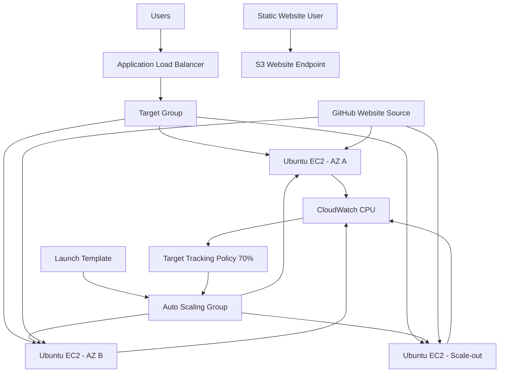

# Part 1 — Introduction, Architecture, Prerequisites and Project Structure

[← Main README](../README.md) | [Next: Part 2 →](README_PART2.md)

## Project Objective

Build a highly available and scalable web application on AWS. The application runs on Ubuntu EC2 instances created from a Launch Template. An Application Load Balancer distributes requests, while an Auto Scaling Group adjusts capacity according to CPU utilization.

A separate static copy of the website is also hosted using Amazon S3 Static Website Hosting.

## Learning Objectives

After completing this project, you will understand:

- EC2 Launch Templates and User Data automation
- Apache installation and website deployment on Ubuntu
- EC2 Instance Metadata Service Version 2
- Application Load Balancers and Target Groups
- Health checks and cross-zone traffic distribution
- Auto Scaling minimum, desired and maximum capacity
- Target Tracking policies using average CPU utilization
- Scale-out and scale-in testing using `stress-ng`
- S3 Static Website Hosting and bucket policies
- Validation, troubleshooting, security and cleanup

## AWS Services Used

| Service | Purpose |
|---|---|
| Amazon VPC | Network boundary |
| Public subnets | ALB and training EC2 placement |
| Security Groups | Stateful traffic filtering |
| EC2 | Apache web servers |
| Launch Template | Repeatable instance configuration |
| Application Load Balancer | HTTP traffic distribution |
| Target Group | Backend registration and health checks |
| Auto Scaling Group | Capacity management |
| CloudWatch | CPU metrics and scaling alarms |
| Amazon S3 | Static website hosting |

## High-Level Architecture



The supplied `infographic.png` is located in the project root:

```markdown

```


## Request Flow

```text
User
  ↓
ALB DNS Name
  ↓
HTTP Listener :80
  ↓
Target Group
  ↓
Healthy EC2 Instance
  ↓
Apache
  ↓
Website response containing Instance ID, AZ and Private IP
```

## Auto Scaling Configuration

| Setting | Value |
|---|---:|
| Minimum capacity | 1 |
| Desired capacity | 1 |
| Maximum capacity | 3 |
| Scaling metric | Average CPU utilization |
| Target value | 70% |

## Recommended AWS Region

This guide uses:

```text
Asia Pacific (Mumbai): ap-south-1
```

You may use another region. Select an Ubuntu AMI and at least two Availability Zones from the chosen region.

## Prerequisites

- AWS account with EC2, ELB, Auto Scaling, CloudWatch and S3 permissions
- GitHub account and public repository
- Git installed locally
- Web browser
- Optional AWS CLI
- Basic Linux, Git, VPC and EC2 knowledge
- An EC2 key pair for SSH troubleshooting

Check tools:

```bash
git --version
aws --version
aws sts get-caller-identity
```

## Network Requirements

For the training setup, use the default VPC or a VPC containing:

- Internet Gateway
- At least two public subnets in different Availability Zones
- `0.0.0.0/0` route to the Internet Gateway
- Available private IP addresses
- Auto-assign public IPv4 enabled if SSH and direct package downloads are required

Example:

| Subnet | Availability Zone |
|---|---|
| Public Subnet A | `ap-south-1a` |
| Public Subnet B | `ap-south-1b` |

> Production design normally places EC2 instances in private subnets and the ALB in public subnets.

## Naming Convention

| Resource | Suggested Name |
|---|---|
| ALB security group | `project-04-alb-sg` |
| EC2 security group | `project-04-web-sg` |
| Launch Template | `project-04-web-lt` |
| Target Group | `project-04-web-tg` |
| Load Balancer | `project-04-alb` |
| Auto Scaling Group | `project-04-web-asg` |
| Scaling Policy | `project-04-cpu-70-policy` |
| S3 bucket | `raghav-project-04-static-site-<unique>` |

## Security Group Design

### ALB Security Group

Inbound:

| Type | Port | Source |
|---|---:|---|
| HTTP | 80 | `0.0.0.0/0` |
| HTTPS | 443 | `0.0.0.0/0` only when configured |

### EC2 Security Group

Inbound:

| Type | Port | Source |
|---|---:|---|
| HTTP | 80 | ALB Security Group |
| SSH | 22 | Your public IP only |

## Recommended Tags

| Key | Value |
|---|---|
| Project | `DevOps-Task-04` |
| Environment | `Training` |
| Owner | `Raghav` |
| ManagedBy | `Manual` |

## Repository Structure

```text
Task4_Highly_Available_Scalable_Web_Application/
├── README.md
├── infographic.png
├── documentation/
├── website/
└── scripts/
```

## Part 1 Checklist

- [ ] AWS Region selected
- [ ] Two Availability Zones identified
- [ ] VPC and public subnets available
- [ ] Internet route verified
- [ ] GitHub repository created
- [ ] Key pair available
- [ ] Naming convention finalized
- [ ] Cost and cleanup requirements understood

[Next: Part 2 — Launch Template, User Data and Apache →](README_PART2.md)
