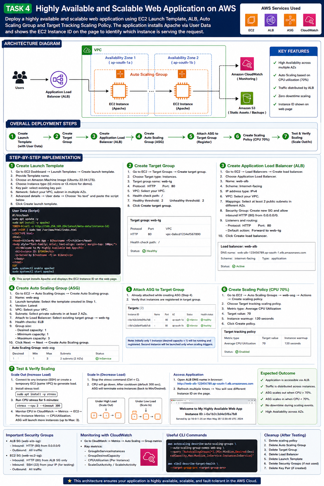
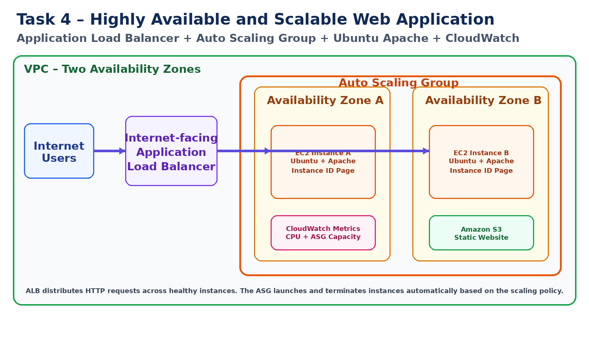
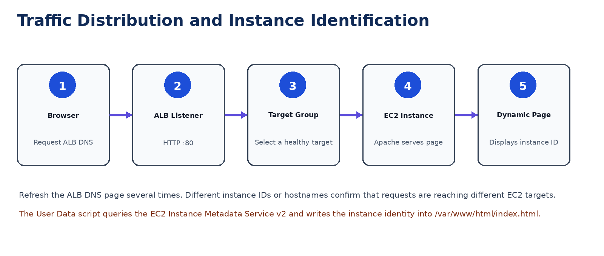
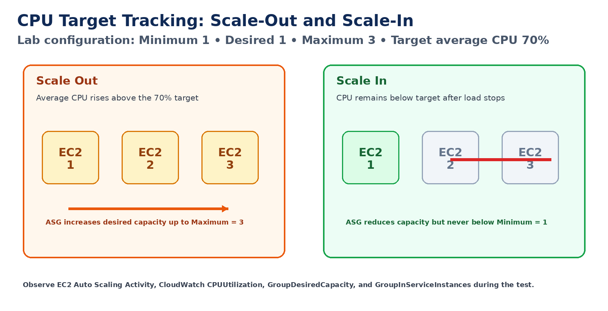
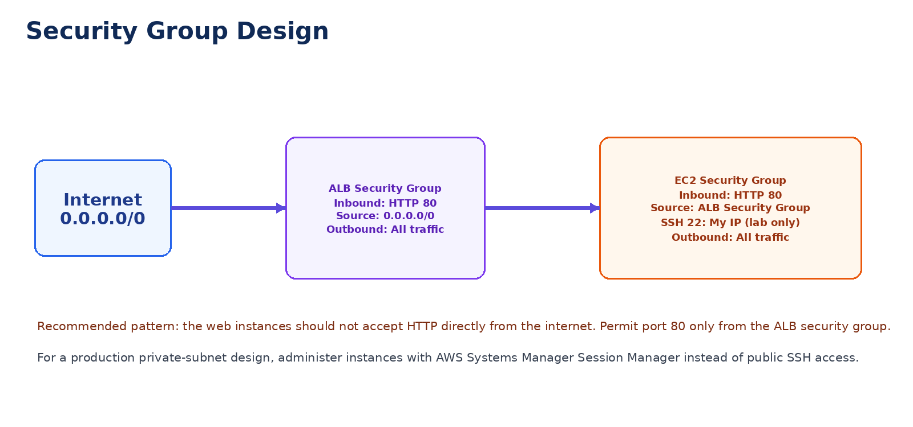
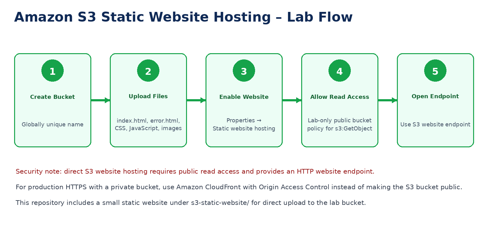

# AWS Project 4: Highly Available and Scalable Web Application



## Project Objective

Build and test a highly available web application using:

- An EC2 Launch Template.
- Ubuntu EC2 instances configured automatically through User Data.
- An internet-facing Application Load Balancer.
- An Application Load Balancer target group.
- An EC2 Auto Scaling Group across two Availability Zones.
- A target tracking policy based on average CPU utilization.
- CPU stress testing to verify scale-out and scale-in.
- Amazon S3 static website hosting as an additional lab.

---

## Architecture



### Request Flow



### Auto Scaling Workflow



### Security Groups



### S3 Static Hosting



---

## Repository Structure

```text
Task-04-Highly-Available-Scalable-Web-App/
├── README.md
├── UPLOAD-TO-GITHUB.md
├── images/
│   ├── task-04-full-infographic.png
│   ├── 01-architecture-diagram.png
│   ├── 02-request-flow.png
│   ├── 03-auto-scaling-workflow.png
│   ├── 04-security-groups.png
│   └── 05-s3-static-hosting.png
├── scripts/
│   ├── user-data.sh
│   └── generate-cpu-load.sh
└── s3-static-website/
    ├── index.html
    ├── error.html
    ├── styles.css
    ├── app.js
    └── bucket-policy.json
```

---

## AWS Services Used

| Service | Purpose |
|---|---|
| Amazon EC2 | Hosts Apache web servers |
| EC2 Launch Template | Defines the EC2 configuration and User Data |
| EC2 Auto Scaling | Maintains and adjusts instance capacity |
| Application Load Balancer | Distributes HTTP traffic |
| Target Group | Performs health checks and routes traffic to EC2 |
| Amazon CloudWatch | Supplies CPU metrics and scaling visibility |
| Amazon S3 | Hosts a separate static website |
| Amazon VPC | Provides subnets, routing and security boundaries |

---

## Recommended Lab Values

| Configuration | Example |
|---|---|
| Region | `ap-south-1` |
| Availability Zones | `ap-south-1a`, `ap-south-1b` |
| Operating System | Ubuntu Server 24.04 LTS |
| Instance Type | `t3.micro` |
| Launch Template | `task4-web-launch-template` |
| Target Group | `task4-web-tg` |
| Load Balancer | `task4-web-alb` |
| Auto Scaling Group | `task4-web-asg` |
| Minimum Capacity | `1` |
| Desired Capacity | `1` |
| Maximum Capacity | `3` |
| Target CPU | `70%` |
| Health Check Path | `/` |

Use a unique naming suffix where required.

---

# Part 1: Prepare the Network

For a simple practice lab, use the default VPC if it has:

- At least two public subnets.
- The subnets are in two different Availability Zones.
- A route to an Internet Gateway.
- Automatic public IPv4 assignment enabled.

For a stronger production design, place the ALB in public subnets and the EC2 instances in private subnets with outbound access through a NAT Gateway.

## Identify Two Subnets

1. Open **VPC → Subnets**.
2. Select two subnets from the same VPC.
3. Confirm they use different Availability Zones.
4. Record:

```text
VPC ID:
Subnet A:
Subnet B:
Availability Zone A:
Availability Zone B:
```

---

# Part 2: Create Security Groups

## ALB Security Group

Create:

```text
Name: task4-alb-sg
Description: Allow public HTTP access to the ALB
```

Inbound rule:

| Type | Port | Source |
|---|---:|---|
| HTTP | 80 | `0.0.0.0/0` |

Outbound:

```text
All traffic
```

## EC2 Security Group

Create:

```text
Name: task4-web-sg
Description: Allow HTTP from the ALB
```

Inbound rules:

| Type | Port | Source |
|---|---:|---|
| HTTP | 80 | `task4-alb-sg` |
| SSH | 22 | My IP — optional for lab testing |

Outbound:

```text
All traffic
```

Do not use `0.0.0.0/0` as the HTTP source on the EC2 security group. Use the ALB security group.

---

# Part 3: Create the EC2 Launch Template

1. Open **EC2 → Launch Templates**.
2. Select **Create launch template**.
3. Configure:

```text
Launch template name: task4-web-launch-template
Template version description: Ubuntu Apache web server v1
```

4. Select:

```text
AMI: Ubuntu Server 24.04 LTS
Architecture: x86_64
Instance type: t3.micro
Key pair: Select your key pair
Security group: task4-web-sg
Storage: 8 GiB gp3
```

5. Expand **Advanced details**.
6. Under **User data**, paste the content from:

```text
scripts/user-data.sh
```

The script:

- Installs Apache.
- Installs `stress-ng`.
- Enables Apache at boot.
- Uses EC2 Instance Metadata Service v2.
- Retrieves the instance ID, private hostname and Availability Zone.
- Creates a custom HTML page.

7. Select **Create launch template**.

## Validate User Data Syntax Locally

```bash
bash -n scripts/user-data.sh
```

---

# Part 4: Create the Target Group

1. Open **EC2 → Target Groups**.
2. Select **Create target group**.
3. Configure:

```text
Target type: Instances
Target group name: task4-web-tg
Protocol: HTTP
Port: 80
IP address type: IPv4
VPC: The selected VPC
Protocol version: HTTP1
```

4. Configure health checks:

```text
Health check protocol: HTTP
Health check path: /
Healthy threshold: 2
Unhealthy threshold: 2
Timeout: 5 seconds
Interval: 30 seconds
Success codes: 200
```

5. Continue to the target registration page.
6. Do not manually register an instance if the target group will be attached to the Auto Scaling Group.
7. Create the target group.

---

# Part 5: Create the Application Load Balancer

1. Open **EC2 → Load Balancers**.
2. Select **Create load balancer**.
3. Choose **Application Load Balancer**.
4. Configure:

```text
Name: task4-web-alb
Scheme: Internet-facing
IP address type: IPv4
```

5. Network mapping:

```text
VPC: Selected VPC
Subnet: Public subnet in Availability Zone A
Subnet: Public subnet in Availability Zone B
```

6. Security group:

```text
task4-alb-sg
```

7. Listener:

```text
Protocol: HTTP
Port: 80
Default action: Forward to task4-web-tg
```

8. Select **Create load balancer**.
9. Wait for the state to become `Active`.
10. Record the ALB DNS name.

---

# Part 6: Create the Auto Scaling Group

1. Open **EC2 → Auto Scaling Groups**.
2. Select **Create Auto Scaling group**.
3. Configure:

```text
Name: task4-web-asg
Launch template: task4-web-launch-template
Version: Latest
```

4. Select the VPC.
5. Select two subnets in different Availability Zones.
6. Under load balancing:

```text
Attach to an existing load balancer
Choose from your load balancer target groups
Target group: task4-web-tg
```

7. Enable Elastic Load Balancing health checks.
8. Configure health check grace period:

```text
180 seconds
```

9. Configure group size:

```text
Desired capacity: 1
Minimum capacity: 1
Maximum capacity: 3
```

10. Continue through notifications and tags.
11. Add tags:

| Key | Value | Tag new instances |
|---|---|---|
| Name | `task4-web-asg-instance` | Yes |
| Project | `AWS-Task-04` | Yes |

12. Create the Auto Scaling Group.

The ASG automatically registers instances with the target group and deregisters terminated instances.

---

# Part 7: Create the CPU Target Tracking Policy

1. Open **EC2 → Auto Scaling Groups**.
2. Select `task4-web-asg`.
3. Open **Automatic scaling**.
4. Select **Create dynamic scaling policy**.
5. Configure:

```text
Policy type: Target tracking scaling
Policy name: task4-cpu-70-target
Metric type: Average CPU utilization
Target value: 70
Instance warmup: 180 seconds
```

6. Create the policy.

Target tracking attempts to keep the selected metric near the target by changing desired capacity within the ASG minimum and maximum limits.

---

# Part 8: Validate ALB and Target Health

## Confirm the EC2 Instance

Open **EC2 → Instances** and confirm that the ASG launched an instance.

Check:

```text
Instance state: Running
Status checks: 2/2 passed
Name: task4-web-asg-instance
```

## Confirm Target Health

1. Open **EC2 → Target Groups**.
2. Select `task4-web-tg`.
3. Open **Targets**.
4. Wait for status:

```text
Healthy
```

If it is unhealthy, review the troubleshooting section.

## Access the Application

Open:

```text
http://<ALB-DNS-NAME>
```

Expected page details:

- Instance ID.
- Private hostname.
- Availability Zone.

Refresh the page multiple times. Initially, only one instance exists, so the same identity will appear.

---

# Part 9: Trigger Scale-Out

## Connect to the Current EC2 Instance

```bash
ssh -i <KEY_FILE>.pem ubuntu@<INSTANCE_PUBLIC_IP>
```

Confirm `stress-ng`:

```bash
stress-ng --version
```

Start CPU load:

```bash
sudo stress-ng --cpu 2 --timeout 600s --metrics-brief
```

The repository also contains:

```bash
./scripts/generate-cpu-load.sh 600 2
```

## Monitor Scaling

Open:

```text
EC2 → Auto Scaling Groups → task4-web-asg → Activity
```

Also monitor:

```text
CloudWatch → Metrics → EC2 → By Auto Scaling Group
```

Useful metrics:

- `CPUUtilization`
- `GroupDesiredCapacity`
- `GroupInServiceInstances`
- `GroupTotalInstances`

Expected result:

1. Average CPU rises.
2. The target tracking policy increases desired capacity.
3. New instances launch up to Maximum = 3.
4. User Data installs Apache automatically.
5. New targets pass health checks.
6. The ALB begins routing traffic to them.

Allow for metric collection, instance launch, User Data execution, warmup and health checks.

---

# Part 10: Verify Traffic Distribution

After two or more targets become healthy:

1. Open the ALB DNS name.
2. Refresh the page repeatedly.
3. Record the displayed instance IDs and Availability Zones.

Optional command-line test:

```bash
for i in {1..15}; do
  curl -s http://<ALB-DNS-NAME> | \
  grep -E "Instance ID|Availability Zone"
  sleep 1
done
```

Expected result:

- Multiple instance IDs appear.
- The application remains available while instances join the target group.

---

# Part 11: Verify Scale-In

Stop the load if it is still running:

```bash
sudo pkill stress-ng
```

Wait while:

1. CPU utilization falls.
2. CloudWatch metrics remain below the target.
3. The target tracking policy decreases desired capacity.
4. The ASG terminates extra instances.
5. Capacity returns toward Desired/Minimum = 1.
6. The ALB continues serving requests through healthy targets.

Review the ASG **Activity** tab for scale-in events.

---

# Part 12: Failure-Replacement Test

This test demonstrates self-healing.

1. Confirm at least one ASG instance is `InService`.
2. Select the instance in **EC2 → Instances**.
3. Terminate it manually.
4. Watch:

```text
EC2 → Auto Scaling Groups → Activity
```

Expected result:

- The ASG detects that capacity is below Desired.
- A replacement instance launches.
- User Data configures Apache.
- The instance becomes healthy in the target group.
- The application remains available through the ALB.

Do not perform this test while cleanup is in progress.

---

# Part 13: Optional AWS CLI Validation

## Describe the ASG

```bash
aws autoscaling describe-auto-scaling-groups \
  --auto-scaling-group-names task4-web-asg \
  --query 'AutoScalingGroups[0].{
    Min:MinSize,
    Desired:DesiredCapacity,
    Max:MaxSize,
    Instances:Instances[*].[InstanceId,LifecycleState,HealthStatus]
  }' \
  --output json
```

## Describe Scaling Activities

```bash
aws autoscaling describe-scaling-activities \
  --auto-scaling-group-name task4-web-asg \
  --max-items 10 \
  --output table
```

## Check Target Health

```bash
TARGET_GROUP_ARN=$(aws elbv2 describe-target-groups \
  --names task4-web-tg \
  --query 'TargetGroups[0].TargetGroupArn' \
  --output text)

aws elbv2 describe-target-health \
  --target-group-arn "$TARGET_GROUP_ARN" \
  --output table
```

## Check the Load Balancer

```bash
aws elbv2 describe-load-balancers \
  --names task4-web-alb \
  --query 'LoadBalancers[0].[DNSName,State.Code,VpcId]' \
  --output table
```

## Check Scaling Policies

```bash
aws autoscaling describe-policies \
  --auto-scaling-group-name task4-web-asg \
  --output table
```

---

# Part 14: Amazon S3 Static Website Hosting

A sample website is available under:

```text
s3-static-website/
```

## Create the Bucket

1. Open **Amazon S3**.
2. Select **Create bucket**.
3. Enter a globally unique name:

```text
task4-raghav-static-site-<unique-number>
```

4. Select the lab Region.
5. Create the bucket.

## Upload Website Files

Upload:

```text
index.html
error.html
styles.css
app.js
```

## Enable Static Website Hosting

1. Open the bucket.
2. Select **Properties**.
3. Scroll to **Static website hosting**.
4. Select **Edit**.
5. Enable:

```text
Static website hosting: Enable
Hosting type: Host a static website
Index document: index.html
Error document: error.html
```

6. Save changes.
7. Record the website endpoint.

## Allow Public Access for This Lab

Direct S3 website hosting requires public read access.

1. Open **Permissions**.
2. Edit **Block public access**.
3. Clear **Block all public access** for this lab bucket.
4. Acknowledge the warning.
5. Save.

Edit:

```text
s3-static-website/bucket-policy.json
```

Replace:

```text
REPLACE_WITH_BUCKET_NAME
```

with the actual bucket name.

Add the policy under **Permissions → Bucket policy**.

Example:

```json
{
  "Version": "2012-10-17",
  "Statement": [
    {
      "Sid": "PublicReadForStaticWebsite",
      "Effect": "Allow",
      "Principal": "*",
      "Action": "s3:GetObject",
      "Resource": "arn:aws:s3:::YOUR_BUCKET_NAME/*"
    }
  ]
}
```

## Verify

Open the S3 website endpoint and select **Run JavaScript Test**.

### Production Security Note

A public S3 website endpoint is suitable for this learning exercise. For production HTTPS hosting with a private bucket, place Amazon CloudFront in front of S3 and use Origin Access Control.

---

# Troubleshooting

## ALB Returns 503

Check:

- The target group has at least one healthy target.
- The listener forwards to the correct target group.
- Apache is running.
- EC2 security group allows port 80 from the ALB security group.
- Health check path is `/`.

Commands:

```bash
sudo systemctl status apache2
sudo apache2ctl configtest
curl -I http://localhost/
sudo tail -100 /var/log/apache2/error.log
```

## Target Is Unhealthy

Check User Data logs:

```bash
sudo tail -200 /var/log/cloud-init-output.log
sudo cloud-init status --long
```

Check the web page:

```bash
curl http://localhost/
```

Check listening ports:

```bash
sudo ss -lntp | grep ':80'
```

## Instance Does Not Receive User Data Changes

Existing instances do not rerun updated Launch Template User Data automatically.

1. Create a new launch-template version.
2. Update the ASG to use the new version.
3. Start an instance refresh or replace existing instances.

## Scale-Out Does Not Occur

Check:

- The scaling policy is enabled.
- Maximum capacity is greater than Desired.
- CPU remains sufficiently high.
- CloudWatch receives CPU metrics.
- Instance warmup is configured.
- The load is running on enough instances to raise the ASG average CPU metric.

With one initial instance, stressing that instance should raise the group average. After more instances launch, load is not automatically copied to them, so average CPU may fall and scaling may stop before reaching three instances. This is normal target-tracking behavior.

## Scale-In Does Not Occur Immediately

Target tracking requires metric evaluation and stabilization. Stop the load and monitor ASG activity instead of terminating the extra instances manually.

## Cannot SSH to an Instance

Check:

- The instance has a public IP for the simple lab.
- Port 22 allows only your current public IP.
- The correct Ubuntu username is used.
- The key permissions are correct.

```bash
chmod 400 key.pem
ssh -i key.pem ubuntu@<PUBLIC_IP>
```

For private instances, use Systems Manager or a bastion host.

## S3 Website Shows AccessDenied

Check:

- Static website hosting is enabled.
- Block Public Access settings permit the lab policy.
- The bucket policy contains the exact bucket name.
- The files are uploaded at the bucket root.
- You are opening the website endpoint, not the object REST endpoint.

---

# Validation Checklist

- [ ] Two subnets in different Availability Zones selected.
- [ ] ALB security group accepts HTTP from the internet.
- [ ] EC2 security group accepts HTTP only from the ALB security group.
- [ ] Launch Template uses Ubuntu and valid User Data.
- [ ] Target Group health check path is `/`.
- [ ] Internet-facing ALB is active.
- [ ] ASG uses two subnets.
- [ ] Minimum = 1, Desired = 1, Maximum = 3.
- [ ] Target tracking policy uses average CPU = 70%.
- [ ] ASG instance is healthy in the target group.
- [ ] Application loads through the ALB DNS name.
- [ ] Instance identity is shown on the web page.
- [ ] CPU stress produces a scale-out activity.
- [ ] New instances register automatically.
- [ ] Multiple instance IDs appear after scale-out.
- [ ] Application remains available during scaling.
- [ ] Capacity decreases after CPU load stops.
- [ ] Replacement instance launches after manual termination.
- [ ] S3 website endpoint displays the sample website.

---

# Cleanup Order

Delete resources in this order to avoid dependency errors and charges:

1. Stop CPU stress tests.
2. Delete the dynamic scaling policy if desired.
3. Set ASG desired and minimum capacity to `0`.
4. Delete the Auto Scaling Group.
5. Delete the Application Load Balancer.
6. Delete the Target Group.
7. Delete all Launch Template versions and the template.
8. Terminate any manually launched EC2 instances.
9. Delete unused security groups.
10. Empty and delete the S3 bucket.
11. Delete unused key pairs.
12. Delete custom VPC resources only if you created them specifically for this lab.
13. Review CloudWatch alarms created for the target tracking policy.

---

# Interview Questions

1. Why must an Application Load Balancer use at least two subnets in different Availability Zones?
2. What is the difference between a Launch Template and an Auto Scaling Group?
3. How does an ASG register instances with an ALB target group?
4. What is target tracking scaling?
5. What do Minimum, Desired and Maximum capacity mean?
6. Why should EC2 HTTP access come from the ALB security group rather than `0.0.0.0/0`?
7. What happens when an ASG instance becomes unhealthy?
8. Why is an instance warmup period important?
9. What is the difference between EC2 health checks and Elastic Load Balancing health checks?
10. Why may a target remain unhealthy while User Data is still running?
11. How can a new Launch Template version be rolled out to existing ASG instances?
12. Why may CPU target tracking scale to two instances but not always reach the maximum of three?
13. What does the ALB listener do?
14. What is the purpose of a target group?
15. Why is direct public S3 website hosting not the preferred production security pattern?

---

# Official AWS References

- [Create an Application Load Balancer](https://docs.aws.amazon.com/elasticloadbalancing/latest/application/create-application-load-balancer.html)
- [Target groups for Application Load Balancers](https://docs.aws.amazon.com/elasticloadbalancing/latest/application/load-balancer-target-groups.html)
- [Create an Auto Scaling Group with a Launch Template](https://docs.aws.amazon.com/autoscaling/ec2/userguide/create-asg-launch-template.html)
- [Target Tracking Scaling Policies](https://docs.aws.amazon.com/autoscaling/ec2/userguide/as-scaling-target-tracking.html)
- [Attach a Load Balancer to an Auto Scaling Group](https://docs.aws.amazon.com/autoscaling/ec2/userguide/attach-load-balancer-asg.html)
- [Configure an S3 Static Website](https://docs.aws.amazon.com/AmazonS3/latest/userguide/HostingWebsiteOnS3Setup.html)
- [S3 Block Public Access](https://docs.aws.amazon.com/AmazonS3/latest/userguide/access-control-block-public-access.html)
