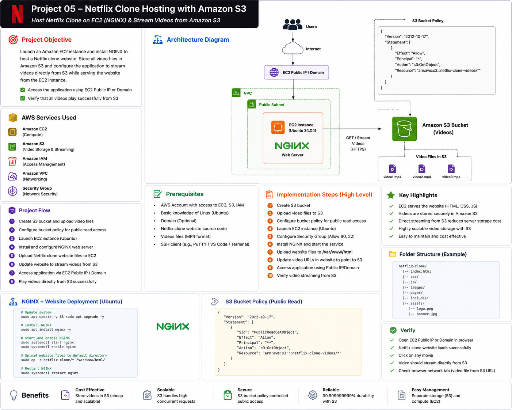

# Part 1 — Introduction, Architecture and Prerequisites

[← Main README](../README.md) | [Next: Part 2 →](README_PART2.md)

## Objective

Deploy a Netflix clone website with the following architecture:

- Ubuntu EC2 instance hosts HTML, CSS and JavaScript
- NGINX serves the website
- Amazon S3 stores video files
- Browser streams video directly from S3
- Website is accessed through EC2 Public IP or a domain

## AWS Services Used

| Service | Purpose |
|---|---|
| Amazon EC2 | Hosts the Netflix clone website |
| Amazon S3 | Stores and serves video files |
| Amazon VPC | Provides networking |
| Security Groups | Controls HTTP and SSH access |
| AWS IAM | Controls access to AWS resources |
| Route 53 | Optional domain configuration |

## Architecture



## Request Flow

```text
User Browser
    ↓
EC2 Public IP or Domain
    ↓
NGINX on Ubuntu EC2
    ↓
HTML, CSS and JavaScript
    ↓
Video element requests MP4 URL
    ↓
Amazon S3
    ↓
Video streams directly to browser
```

## Benefits

- EC2 handles only website content
- S3 handles video storage
- Lower EC2 disk usage
- S3 scales automatically
- Easy separation of application and media storage
- Videos can be updated without redeploying EC2

## Prerequisites

- AWS account
- Ubuntu EC2 key pair
- GitHub account
- Public or private Netflix clone source code
- MP4 video files
- SSH client
- Basic Linux and HTML knowledge
- Optional domain name

## Recommended Region

Example:

```text
ap-south-1
```

Keep EC2 and S3 in the same Region when possible.

## Naming Convention

| Resource | Name |
|---|---|
| EC2 | `project-05-netflix-web` |
| Security Group | `project-05-netflix-sg` |
| S3 Bucket | `raghav-project-05-netflix-videos-<unique>` |
| Website Directory | `/var/www/netflix-clone` |

## Security Group Rules

Inbound:

| Type | Port | Source |
|---|---:|---|
| HTTP | 80 | `0.0.0.0/0` |
| HTTPS | 443 | `0.0.0.0/0` when configured |
| SSH | 22 | Your public IP only |

## Project Checklist

- [ ] AWS Region selected
- [ ] EC2 key pair available
- [ ] Netflix clone files available
- [ ] MP4 videos prepared
- [ ] Unique S3 bucket name selected
- [ ] Cost and cleanup understood
