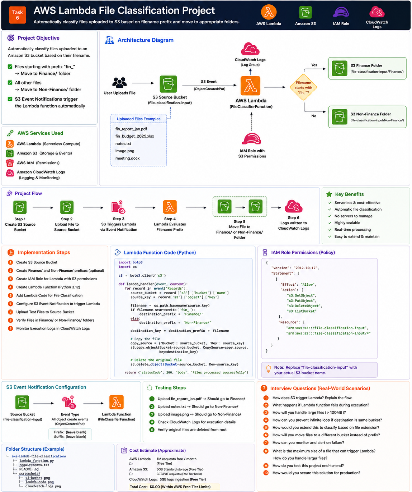

# Part 1 — Introduction, Architecture and Prerequisites

[← Main README](../README.md) | [Next: Part 2 →](README_PART2.md)

## Objective

Build an event-driven serverless solution that classifies uploaded files by filename.

Rules:

```text
fin_report.csv       → Finance/fin_report.csv
fin_budget.xlsx      → Finance/fin_budget.xlsx
employee_list.csv    → Non-Finance/employee_list.csv
notes.txt            → Non-Finance/notes.txt
```

## AWS Services Used

| Service | Purpose |
|---|---|
| Amazon S3 | Stores uploaded and classified files |
| AWS Lambda | Runs classification logic |
| AWS IAM | Grants Lambda permission to read, copy and delete S3 objects |
| Amazon CloudWatch | Stores Lambda logs and metrics |
| S3 Event Notifications | Invokes Lambda on object creation |

## Architecture



## Recommended Design

Use one S3 bucket with three prefixes:

```text
incoming/
Finance/
Non-Finance/
```

This is simpler and cheaper than using three separate buckets.

## Important Loop Prevention

Configure the S3 trigger only for:

```text
Prefix: incoming/
```

Do not trigger Lambda for the entire bucket.

Otherwise, when Lambda copies an object to `Finance/` or `Non-Finance/`, S3 may invoke the function again and create a recursive loop.

## Naming Convention

| Resource | Suggested Name |
|---|---|
| S3 bucket | `raghav-task6-file-classifier-<unique>` |
| Lambda function | `task6-file-classifier` |
| IAM role | `task6-lambda-s3-role` |
| Log group | `/aws/lambda/task6-file-classifier` |

## Prerequisites

- AWS account
- Permissions for S3, Lambda, IAM and CloudWatch
- AWS Region selected
- Optional AWS CLI
- Basic Python knowledge
- Sample files for testing

## Recommended Region

```text
ap-south-1
```

## Security Principle

Grant Lambda access only to the required bucket and prefixes.

Avoid:

```json
"Resource": "*"
```

Prefer the exact bucket ARN.

## Checklist

- [ ] AWS Region selected
- [ ] Unique bucket name prepared
- [ ] Prefix-based design understood
- [ ] Loop prevention understood
- [ ] Sample test files prepared
