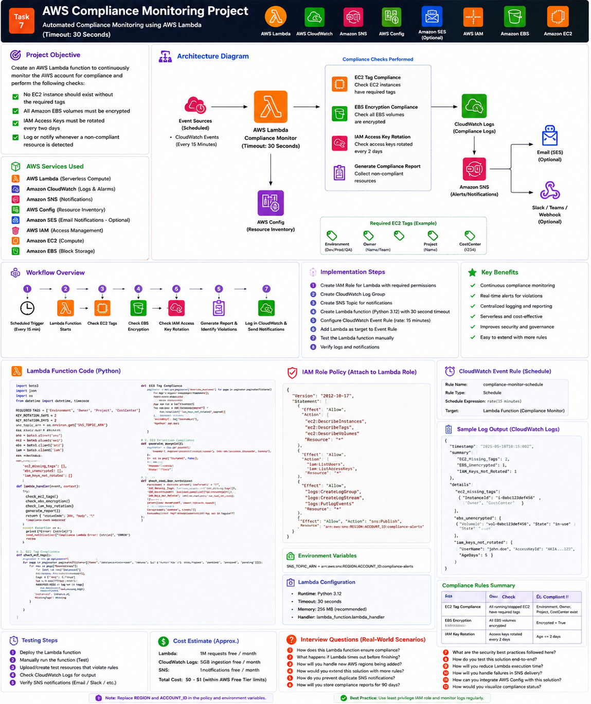

# Part 1 — Introduction, Architecture and Prerequisites

[← Main README](../README.md) | [Next: Part 2 →](README_PART2.md)

## Objective

Create a serverless compliance monitor with these rules:

| Rule | Compliant Condition |
|---|---|
| EC2 tags | All required tag keys exist and contain non-empty values |
| EBS encryption | `Encrypted` is `true` |
| IAM key rotation | Active access-key age is no more than 2 days |
| Reporting | Violations are logged and optionally sent through SNS |

## AWS Services Used

| Service | Purpose |
|---|---|
| AWS Lambda | Runs the compliance checks |
| Amazon EC2 API | Returns instances, tags and EBS volume details |
| AWS IAM API | Returns users and access-key metadata |
| Amazon CloudWatch Logs | Stores structured reports and errors |
| Amazon SNS | Sends email, SMS or webhook notifications |
| EventBridge Scheduler | Invokes Lambda on a recurring schedule |
| AWS CloudFormation | Optional repeatable deployment |

## Architecture



## Required EC2 Tags

Default required tags:

```text
Environment
Owner
Project
CostCenter
```

They are configurable through the `REQUIRED_TAGS` Lambda environment variable.

## Access-Key Rotation Rule

This task requires rotation every two days.

The function calculates:

```text
Key age = Current UTC time − Access-key CreateDate
```

An active key is non-compliant when:

```text
Age > 2 days
```

> Two days is unusually aggressive for many production environments, but the implementation follows this task requirement.

## Continuous Monitoring

Lambda is invoked on a recurring EventBridge schedule.

Recommended lab schedule:

```text
rate(15 minutes)
```

For a low-change production account, hourly or daily checks may be more appropriate.

## Region Strategy

EC2 and EBS are regional services. IAM is global.

The function supports:

```text
SCAN_REGIONS=ap-south-1
```

or multiple regions:

```text
SCAN_REGIONS=ap-south-1,us-east-1,eu-west-2
```

Because the timeout is only 30 seconds, begin with one or a small number of regions.

## Prerequisites

- AWS account
- Permissions for Lambda, IAM, EC2, SNS, CloudWatch and EventBridge Scheduler
- At least one EC2 instance for tag testing
- At least one EBS volume for encryption testing
- Optional IAM test user with an access key
- Confirmed SNS email subscription for notifications

## Naming Convention

| Resource | Name |
|---|---|
| Lambda | `task7-compliance-monitor` |
| IAM role | `task7-compliance-lambda-role` |
| SNS topic | `task7-compliance-alerts` |
| Schedule | `task7-compliance-schedule` |
| Log group | `/aws/lambda/task7-compliance-monitor` |

## Checklist

- [ ] Region selected
- [ ] Required tags agreed
- [ ] Two-day key rule understood
- [ ] Notification email available
- [ ] 30-second timeout requirement understood
