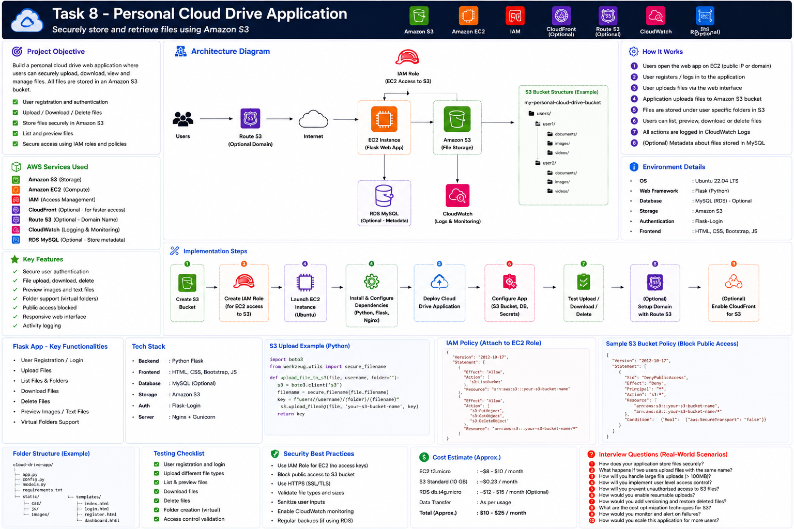

# Project 08 — Personal Cloud Drive Application

This project builds a personal cloud-drive web application using Python Flask and Amazon S3.

## Features

- User registration and login
- Upload files securely to Amazon S3
- List files by logged-in user
- Download files from S3
- Delete files
- Virtual user folders
- Private S3 bucket
- EC2 IAM role instead of access keys
- CloudWatch-ready logging
- Optional Route 53 and HTTPS

## Documentation

1. [Part 1 — Introduction, Architecture and Prerequisites](documentation/README_PART1.md)
2. [Part 2 — S3 Bucket, IAM Role and Security](documentation/README_PART2.md)
3. [Part 3 — Flask Application Setup](documentation/README_PART3.md)
4. [Part 4 — EC2, NGINX and Gunicorn Deployment](documentation/README_PART4.md)
5. [Part 5 — Testing, Cleanup and Troubleshooting](documentation/README_PART5.md)

## Interview Preparation

- [Interview Guide](interview/Interview_Guide.md)
- [Production Scenarios](interview/Production_Scenarios.md)
- [AWS CLI Cheat Sheet](interview/AWS_CLI_CheatSheet.md)
- [Troubleshooting Guide](interview/Troubleshooting_Guide.md)
