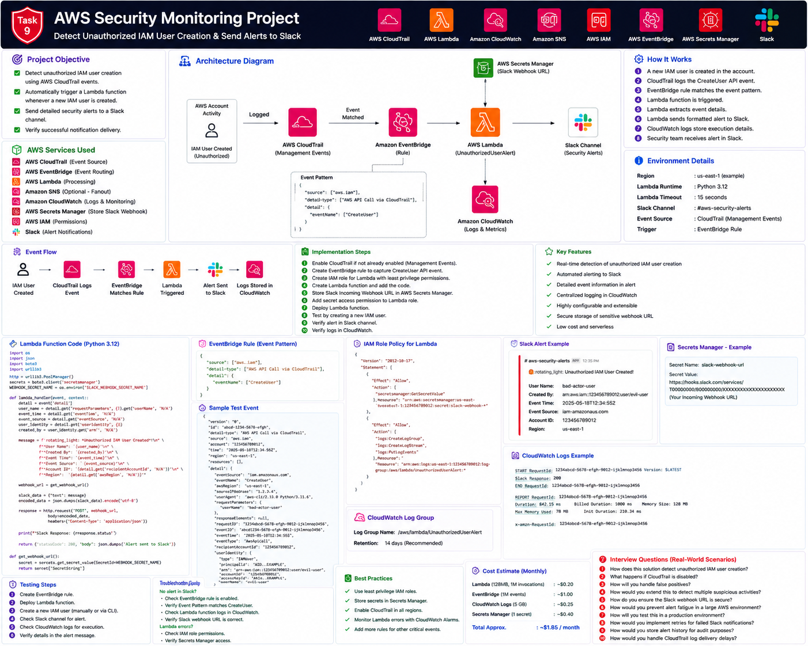

# Project 09 — AWS Security Monitoring



This project detects unauthorized IAM user creation in an AWS account and sends a detailed alert to Slack.

## Security Flow

```text
IAM CreateUser API call
        ↓
AWS CloudTrail management event
        ↓
Amazon EventBridge rule
        ↓
AWS Lambda
        ↓
AWS Secrets Manager retrieves Slack webhook
        ↓
Detailed Slack security alert
        ↓
CloudWatch Logs record execution and delivery status
```

## Documentation

1. [Part 1 — Introduction, Architecture and Prerequisites](documentation/README_PART1.md)
2. [Part 2 — CloudTrail, Slack Webhook and Secrets Manager](documentation/README_PART2.md)
3. [Part 3 — Lambda Function and IAM Permissions](documentation/README_PART3.md)
4. [Part 4 — EventBridge Rule, Testing and Verification](documentation/README_PART4.md)
5. [Part 5 — Cleanup, Troubleshooting and Production Improvements](documentation/README_PART5.md)

## Interview Preparation

- [Interview Guide](interview/Interview_Guide.md)
- [Production Scenarios](interview/Production_Scenarios.md)
- [AWS CLI Cheat Sheet](interview/AWS_CLI_CheatSheet.md)
- [Troubleshooting Guide](interview/Troubleshooting_Guide.md)
